## Opis analizy

Analizie poddany został zbiór danych dotyczących połowu śledzia atlantyckiego oraz warunków środowiska w jakim żyje. Celem analizy była próba odpowiedzi na pytanie dlaczego od pewnego czasu złowione ryby mają coraz mniejszy rozmiar. Eksploracja rozpoczyna się od załadowania odpowiednich bibliotek, następnie ustawione zostaje ziarno zapewniające powtarzalność uzyskanych wyników oraz wczytany zostaje zbiór danych. Sprawdzona zostaje liczba pustych wartości oraz kształt zbioru. Ze względu na relatywnie niską ilość poszczególnych wartości NA zostaje podjęta decyzja o ich usunięciu. 

Później przyglądano się bliżej poszczególnym atrybutom, ich rozkładom wartości oraz postawowym statyskom (mean, min, max, sd, etc.).

Kolejnym krokiem było sprawdzenie wzajemnych zależności pomiędzy atrybutami (włączając w to zmienną przewidywaną). Większość atrybutów nie wykazuje znaczącej wzajemnej zależności. Jednak kilka zmiennych, w szczególności dotyczących dostępności planktonu, jest silnie skorelowane. Dla zmiennych wykazujących wzajemne powiązania dokonano dodatkowej wizualizacji. Żaden z atrybutów nie jest bezpośrednio skorelowany z wartością zmiennej przewidywanej.

Następnie sporządzono wykres zmiany długości śledzia w czasie, jasno wskazujący na spadek średniego rozmiaru złowionych ryb.

Następny etap opierał się na zbudowaniu regresora, mającego za cel predykcję długości śledzia. Dokonano podziału zbioru na część treningową, walidacyjną oraz testową. W pierwszej kolejności przetestowano prosty model regresji liniowej i zmierzono jego jakość predykcji przy pomocy metryk RMSE oraz R2. 
Drugim wybranym modelem był XGBoost - wydajna biblioteka udostępniająca rozwiązania z dziedziny gradient boosting, oparte na drzewach decyzyjnych. Jest często używany w problemach analizy danych. Model wymagał dodatkowej konwersji danych na kompatybilny format. Następnie przy pomocy zbioru walidacyjnego dobrano parametry, tak, aby zmniejszyć overfitting. Użycie XGBoost pozwoliło na wyraźną poprawę wyników predykcji.

Finalnie, dla modelu o najlepszej skuteczności(XGBoost), przy pomocy metody LIME dokonano analizy ważności atrybutów oraz ich wpływu na estymowaną wartość w poszczególnych przypadkach.

Do najważniejszych cech należą odwiednio:

* `sst` - `0.57`,
* `recr` - `0.14`,
* `lcop1` - `0.06`.

XGBoost dokonuje automatycznej analizy zależności zmiennych, na wykresie feature importance można zauważyć, że tylko jedna z silnie skorelowanych zmiennych ma wyższe znaczenie dla modelu.

Z dużego wpływu temperatury przy powierzchni wody (`sst`) na podejmowaną przez model decyzję można by wnioskować, że drobny wzrost temperatury (mniej więcej od podobnego okresu, gdy długość śledzia zaczęła spadać) mógł mieć wpływ na zmniejszenie rozmiaru poławianych śledzi.

## Wstępne przetwarzanie

#### Wykorzystane biblioteki

```r
library(reshape2)
library(plyr)
library(dplyr)
library(caret)
library(corrplot)
library(ggplot2)
library(plotly)
library(glmnet)
library(gbm)
library(xgboost)
library(lime)
library(nnet)
```


#### Powtarzalność wyników

```r
set.seed(10)
```

#### Wczytywanie danych

Wartości puste oznaczone są znakiem "?", przy wczywaniu zbioru korzystamy z parametru `na.strings` do zastąpienia ich wartością `NA`

```r
data <- read.csv("sledzie.csv", header=TRUE, na.strings = "?")
```

#### Brakujące dane według kolumn

```r
nmissing <- function(x) sum(is.na(x))

knitr::kable(colwise(nmissing)(data))
```


  X   length   cfin1   cfin2   chel1   chel2   lcop1   lcop2   fbar   recr   cumf   totaln    sst   sal   xmonth   nao
---  -------  ------  ------  ------  ------  ------  ------  -----  -----  -----  -------  -----  ----  -------  ----
  0        0    1581    1536    1555    1556    1653    1591      0      0      0        0   1584     0        0     0


Wymiary zbioru: (52582, 16)

Całkowita liczba wierszy: 52582

Liczba wierszy zawierających pustą wartość: 10094

Liczba wierszy po usunięciu pustych wartości: 42488


#### Przykładowe wartości ze zbioru

             X   length     cfin1     cfin2      chel1      chel2      lcop1      lcop2    fbar     recr        cumf     totaln        sst        sal   xmonth     nao
------  ------  -------  --------  --------  ---------  ---------  ---------  ---------  ------  -------  ----------  ---------  ---------  ---------  -------  ------
24923    24922     24.0   0.00000   0.70118   11.50000    5.67765   23.00000    9.17171   0.227   421391   0.1480941   730351.2   13.63160   35.50835        2   -2.86
18378    18377     25.5   0.00000   0.72727    2.59316   33.12121    5.35088   37.23232   0.547   148045   0.2714717   179955.4   13.39520   35.49992        5   -2.14
22182    22181     25.5   0.00000   0.70118   11.50000    5.67765   23.00000    9.17171   0.227   421391   0.1480941   730351.2   13.63160   35.50835        4   -2.86
34827    34826     25.0   3.14462   5.80145    4.26148   18.43839    7.67148   27.47359   0.254   474983   0.2073709   534157.2   13.89253   35.50455        5   -0.75
46082    46081     22.5   0.05455   0.23134    1.48629   11.67093    1.83515   17.80753   0.591   473462   0.3758273   306067.6   14.35600   35.52329        9    0.72

## Analiza wartości atrybutów

W zbiorze znajdują się następujące kolumny(atrybuty):

- **length**: długość złowionego śledzia [cm],
- **cfin1**: dostępność planktonu [zagęszczenie Calanus finmarchicus gat. 1],
- **cfin2**: dostępność planktonu [zagęszczenie Calanus finmarchicus gat. 2],
- **chel1**: dostępność planktonu [zagęszczenie Calanus helgolandicus gat. 1],
- **chel2**: dostępność planktonu [zagęszczenie Calanus helgolandicus gat. 2],
- **lcop1**: dostępność planktonu [zagęszczenie widłonogów gat. 1],
- **lcop2**: dostępność planktonu [zagęszczenie widłonogów gat. 2],
- **fbar**: natężenie połowów w regionie [ułamek pozostawionego narybku],
- **recr**: roczny narybek [liczba śledzi],
- **cumf**: łączne roczne natężenie połowów w regionie [ułamek pozostawionego narybku],
- **totaln**: łączna liczba ryb złowionych w ramach połowu [liczba śledzi],
- **sst**: temperatura przy powierzchni wody [°C],
- **sal**: poziom zasolenia wody [Knudsen ppt],
- **xmonth**: miesiąc połowu [numer miesiąca],
- **nao**: oscylacja północnoatlantycka [mb].


### Długość złowionego śledzia **length**

Na histogramie długości złowionego śledzia wyraźnie rysuje się rozkład normalny. Odchylenie standardowe jest relatywnie niskie, równe jest 1,65 cm.
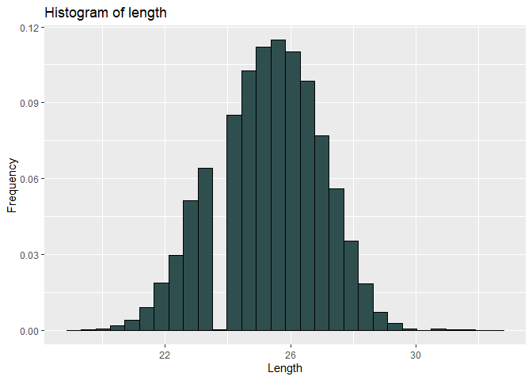<!-- -->

```
##     Min.  1st Qu.   Median     Mean  3rd Qu.     Max. Std.Dev. 
##    19.00    24.00    25.50    25.30    26.50    32.50     1.65
```
### Dostępność planktonu **cfin1** 

Dostępność planktonu `cfin1` w okresie pomiarów była zdecydowanie niska, rozkład wartości jest w ponad 80% zdominowany przez wartość minimalną. Zdarzają się nieliczne wysokie wartości.
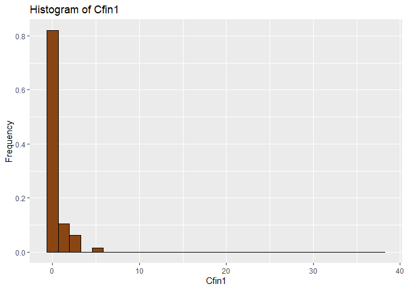<!-- -->

```
##     Min.  1st Qu.   Median     Mean  3rd Qu.     Max. Std.Dev. 
##   0.0000   0.0000   0.1111   0.4457   0.3333  37.6667   0.9800
```

### Dostępność planktonu **cfin2**

Podobnie jak w przypadku `cfin1`, rozkład `cfin2` jest zdominowany przez niskie wartości, jednak w znacznie mniejszym stopniu. W tym przypadku również występują wyższe wartości cechy, jednak tutaj układają się w widoczne grupy.
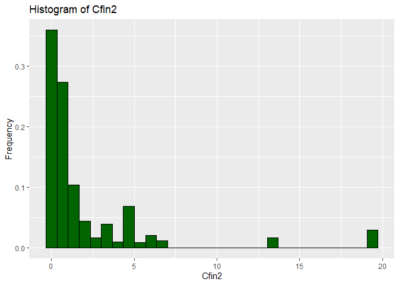<!-- -->

```
##     Min.  1st Qu.   Median     Mean  3rd Qu.     Max. Std.Dev. 
##   0.0000   0.2778   0.7012   2.0269   1.7936  19.3958   3.7200
```

### Dostępność planktonu **chel1**

Analogicznie jak pozostałych przypadkach widoczna jest niska dostępność planktonu `chel1`.
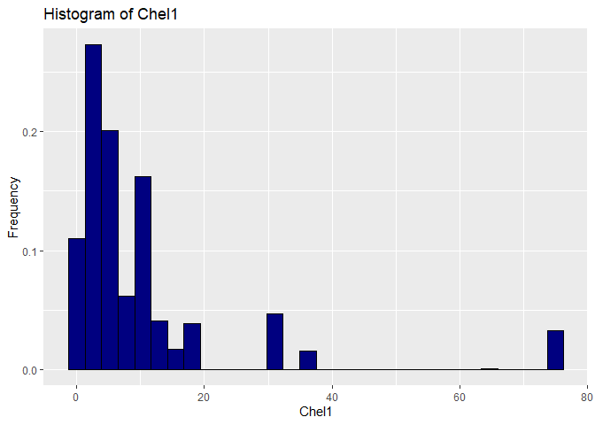<!-- -->

```
##     Min.  1st Qu.   Median     Mean  3rd Qu.     Max. Std.Dev. 
##    0.000    2.469    5.750   10.016   11.500   75.000   14.320
```

### Dostępność planktonu **chel2**

Dostępność `chel2` w całym zbiorze jest dość zróżnicowana, w rozkładzie występuje dużo różnych wartości o podobnej częstości występowania.
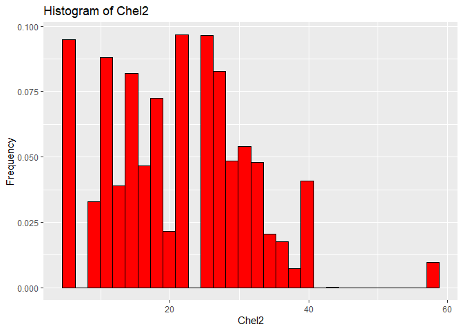<!-- -->

```
##     Min.  1st Qu.   Median     Mean  3rd Qu.     Max. Std.Dev. 
##    5.238   13.427   21.435   21.197   27.193   57.706    9.990
```

### Dostępność planktonu **lcop1**

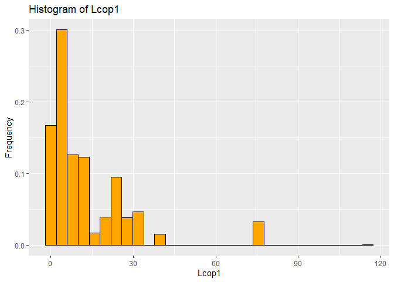<!-- -->

```
##     Min.  1st Qu.   Median     Mean  3rd Qu.     Max. Std.Dev. 
##   0.3074   2.5479   7.0000  12.8386  21.2315 115.5833  15.1000
```

### Dostępność planktonu **lcop2**

Podobnie jak `chel2`, występowanie planktonu `lcop2` jest dość zróżnicowane. Wartości obu planktonów wydają się być skorelowane.

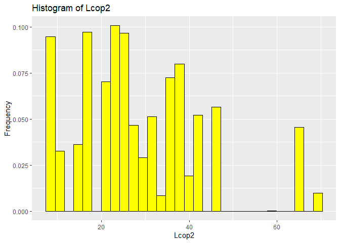<!-- -->

```
##     Min.  1st Qu.   Median     Mean  3rd Qu.     Max. Std.Dev. 
##    7.849   17.808   24.859   28.396   37.232   68.736   13.870
```

### Natężenie połowów w regionie **fbar**

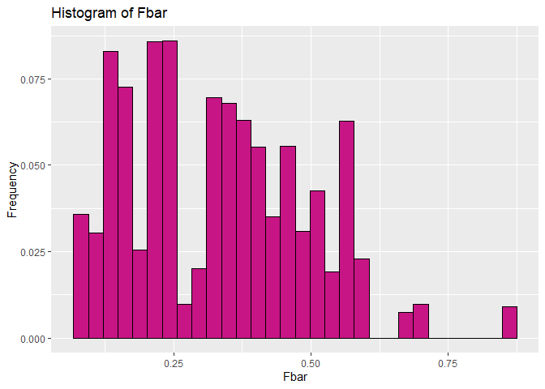<!-- -->

```
##     Min.  1st Qu.   Median     Mean  3rd Qu.     Max. Std.Dev. 
##   0.0680   0.2270   0.3320   0.3306   0.4650   0.8490   0.1600
```

### Roczny narybek **recr**

Zmienna `recr` przedstawia roczny narybek reprezentowany w postaci liczby złowionych ryb, wartości liczbowe osiągają dość wysokie wartości, niejednokrotnie przekraczające milion.
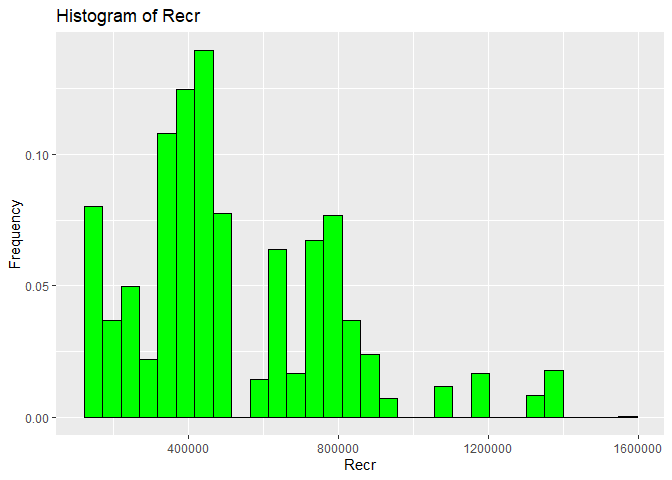<!-- -->

```
##     Min.  1st Qu.   Median     Mean  3rd Qu.     Max. Std.Dev. 
##   140515   360061   421391   519877   724151  1565890   270639
```

### Łączne roczne natężenie połowów w regionie **cumf**

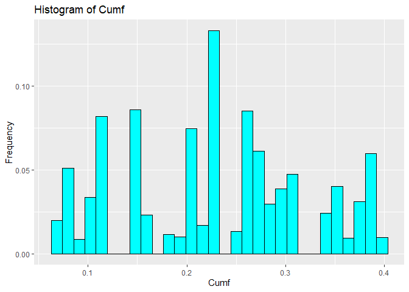<!-- -->

```
##     Min.  1st Qu.   Median     Mean  3rd Qu.     Max. Std.Dev. 
##  0.06833  0.14809  0.23191  0.22987  0.29803  0.39801  0.09000
```

### Łączna liczba ryb złowionych w ramach połowu **totaln**

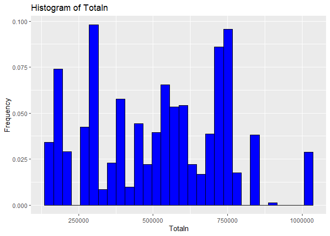<!-- -->

```
##     Min.  1st Qu.   Median     Mean  3rd Qu.     Max. Std.Dev. 
##   144137   306068   539558   515082   730351  1015595   221389
```

### Temperatura przy powierzchni wody **sst** 

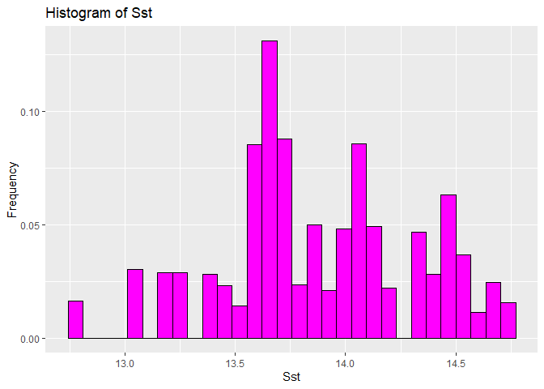<!-- -->

```
##     Min.  1st Qu.   Median     Mean  3rd Qu.     Max. Std.Dev. 
##    12.77    13.60    13.86    13.87    14.16    14.73     0.44
```

### Poziom zasolenia wody **sal** 

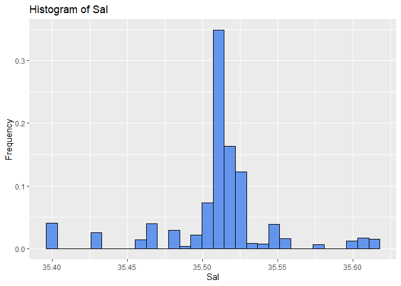<!-- -->

```
##     Min.  1st Qu.   Median     Mean  3rd Qu.     Max. Std.Dev. 
##    35.40    35.51    35.51    35.51    35.52    35.61     0.04
```

### Miesiąc połowu **xmonth**

Dane dotyczące miesiąca mają w przybliżeniu rozkład normalny, większość pomiarów pochodzi z okresu letnio-jesiennego.
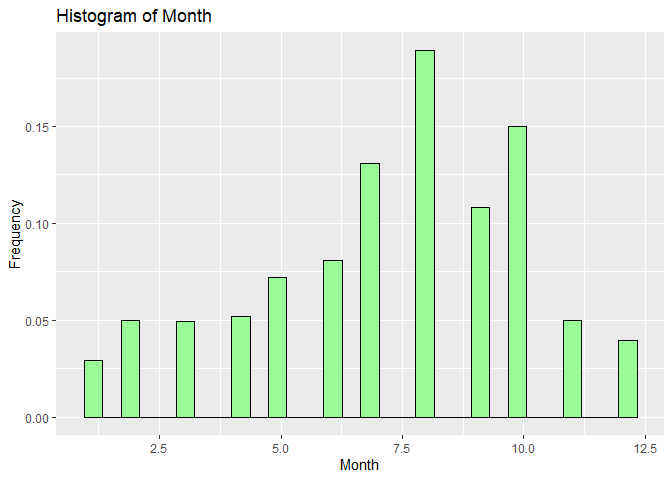<!-- -->

```
##     Min.  1st Qu.   Median     Mean  3rd Qu.     Max. Std.Dev. 
##    1.000    5.000    8.000    7.252    9.000   12.000    2.760
```

### Oscylacja północnoatlantycka **nao**

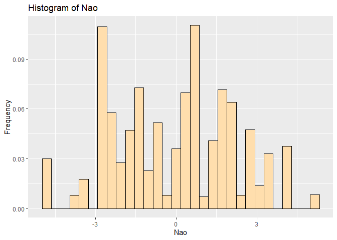<!-- -->

```
##     Min.  1st Qu.   Median     Mean  3rd Qu.     Max. Std.Dev. 
## -4.89000 -1.90000  0.20000 -0.09642  1.63000  5.08000  2.25000
```


## Zależności między zmiennymi
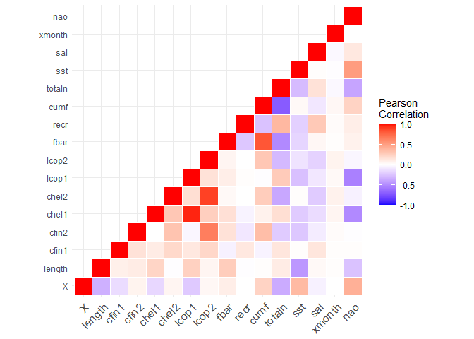<!-- -->

Z wykresu można wywnioskować, że wiekszość zmiennych jest skorelowana ze sobą jedynie w lekkim stopniu lub wcale. Jest jednak kilka wyjątków, przede wszystkim w przypadku dostępności niektórych gatunków planktonu. Występują dwie bardzo silne korelacje:

*  `0.96` między `chel1`, a `lcop1`,
*  `0.89` między `chel2`, a `lcop2`.

oraz kolejna para silnych korelacji dodatnich:

*  `0.82` między `fbar`, a `cumf`
*  `0.65` między `cfin2`, a `lcop2`

i jedna silna korelacja ujemna:

*  `-0.71` między `totaln`, a `cumf`


Na wykresie widzimy bardzo silnie skorelowane zmienne `lcop1` oraz `chel1`
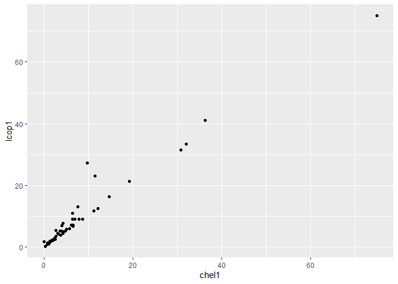<!-- -->

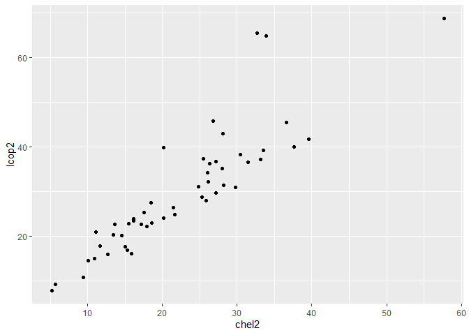<!-- -->


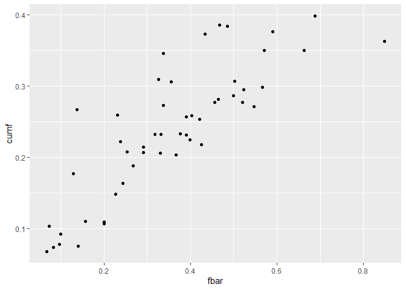<!-- -->


W tym przypadku mamy do czynienia z negatywną korelacją zmiennych `totaln` i `cumf`. Siła korelacji jest mniejsza niż w poprzednich przypadkach, jednak wciąż można łatwo dostrzec malejący trend.
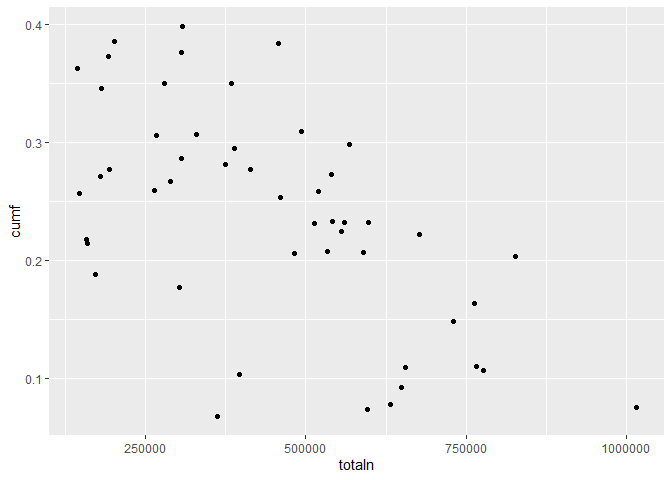<!-- -->


## Zmiana długości śledzia w czasie

Zaprezentowany wykres, celem zwiększenia czytelności, jest przygotowany na bazie próbki 1000 pomiarów. Dzięki wygładzonej linii średniej można łatwo dostrzec jaki był kształt trendu w czasie. Interaktywny wykres pozwala dokładnie prześledzić zmianę wartości, na wykresie wyraźnie widać, że po około 16000. próbce średnia długość śledzia zaczyna spadać, dzieje się tak aż do końca badanego okresu.
<!--html_preserve--><div id="htmlwidget-4762512b3757c2571ef1" style="width:672px;height:480px;" class="plotly html-widget"></div>
<script type="application/json" data-for="htmlwidget-4762512b3757c2571ef1">{"x":{"data":[{"x":[48349,34761,21511,49910,28833,19519,28856,7585,40571,18647,13156,39436,38380,47314,37909,40966,9323,32172,36307,17863,43336,42611,44272,16938,37672,50565,1600,22346,13880,41910,43830,2437,4997,33035,38710,34510,42837,27083,45884,17908,28600,3793,18751,23002,44646,19130,49681,16065,12854,14683,23630,8336,41851,33490,21099,47863,36646,19441,28587,10392,38393,50840,14827,5870,41918,36429,22784,43457,33509,43130,10088,18688,31475,36993,17729,22446,42448,44480,4390,17745,35750,24163,33554,31640,37871,18549,2108,45062,36400,7669,13211,668,47728,30956,29472,32337,11093,16031,47654,47303,21065,30884,47111,16623,9700,11234,38734,23596,22599,51623,29307,29833,6836,38813,25557,6017,32263,33756,42447,17280,50039,29191,17359,24265,47910,2033,11832,37534,50127,7247,14705,4139,24402,10919,48140,17440,2855,29209,22345,1251,19126,29694,26914,47560,31835,28909,3006,10786,19390,22998,20372,20847,38250,25311,30923,23635,45350,6870,25479,47500,52286,48982,49327,574,15536,35522,179,32793,41763,16639,25216,31240,11324,30374,1853,46285,21220,32553,12353,29845,38007,22298,3865,51746,44264,24837,14881,47887,34142,40320,35939,12280,39068,11370,36497,26978,42282,47378,15017,6868,19208,1068,26176,49510,18693,43895,29430,9628,23706,29428,39495,28322,25605,30413,15145,51921,2092,36788,46330,15372,17075,43802,37164,2971,50543,15758,15310,8879,3435,35860,2894,32965,9659,38217,44715,38246,39850,30467,40600,23066,10788,14086,1079,2048,12678,41791,24371,41622,37417,15380,41297,14796,24949,2521,30160,29409,33817,9562,3503,2047,7639,45136,32673,12879,45449,22975,13916,22584,3741,29871,18608,28917,12610,3537,52070,46677,42242,45244,15302,14114,25510,33046,38641,19807,45721,20969,35188,14318,6062,35546,24556,34529,18090,25686,20266,11782,9439,34073,51570,9257,36699,26650,42672,2731,51397,48554,46828,42605,22564,20063,8743,26804,36519,41333,26903,16279,50253,18939,42966,46601,13195,7278,18224,33766,13804,6645,49077,42879,39041,35863,44006,31778,10061,873,39074,15361,31123,5649,30192,25608,27745,29865,21591,45146,50424,51223,15846,28940,27671,3462,11544,28013,17249,47242,26114,23364,18635,42391,49004,27102,7084,38453,30290,19783,14356,16137,36604,30869,14743,26709,2980,23086,1237,46270,18229,23498,21171,19146,40930,13843,51613,47757,38704,41877,9074,18807,613,12005,19023,14980,48680,16459,18473,9381,30915,22250,18311,25097,5422,3870,11981,31484,41934,12148,24272,17376,43563,16328,21941,15788,45581,25157,29757,7764,2576,44666,13692,31232,27430,6321,23222,7663,40899,23208,52013,52086,31280,19427,3029,39581,48146,34204,44386,29589,23261,11676,16728,25565,26229,18082,2386,6175,2309,33452,42443,6187,27300,44537,5086,14352,20971,20431,19190,8875,26994,28504,7363,48321,10746,2029,45607,30038,17013,32776,40882,5941,19822,23157,14600,39355,43682,40766,34768,37998,47463,6210,25474,17882,44554,17377,13793,13724,44804,49056,27840,18771,33489,9071,10153,24590,21852,12469,50848,4908,705,24711,21419,10428,31912,4169,12803,4170,46464,50245,10758,13539,22553,19286,44407,49617,22600,749,2652,30924,34178,42084,37071,35491,52216,30498,9899,35022,35658,39353,21441,3363,8979,9317,24088,40916,19619,29008,15505,39136,13446,8181,34179,1841,29790,42050,31723,23982,38507,46646,28244,41571,1287,36011,44981,9703,5412,22128,13530,36279,46511,36139,46545,18136,40094,41202,10204,51879,29635,4277,14302,3934,17384,48695,33830,24909,29851,29868,45613,894,42528,1238,31985,6638,13525,42518,31085,50600,45173,28201,1082,2799,14613,40162,31662,44665,1903,11289,43850,37947,15797,8414,10420,30397,11090,37227,41431,16316,18890,12247,82,30310,34747,52490,20138,30195,22421,48879,1966,4181,23497,11586,14027,33785,21647,27017,1087,39392,9191,18779,39327,28857,35612,308,5510,36885,23541,21421,37571,44794,6922,36412,42883,25257,5913,28229,14602,31638,30373,2061,165,8943,36452,33879,19019,5144,31371,12168,18109,13784,38996,3958,49208,22697,14862,38737,16944,6920,15027,16427,19989,19590,7620,29556,16383,35834,38987,10821,51669,13973,29234,14371,13365,32481,41738,26067,9068,21641,24764,50694,35699,20216,5113,27831,26590,36962,13579,35172,48959,26125,19147,36924,34903,32109,22368,1934,20974,23000,28028,30519,1088,32324,43774,15074,21557,45250,8525,50827,39193,27962,34542,45776,20503,4604,8785,23905,18781,10583,21188,25071,7463,4993,17259,2997,34680,31858,17030,35005,5556,37472,46404,6278,10343,47968,44647,34359,12357,7497,494,1209,4041,38942,36361,50833,49029,9837,51633,27552,30719,50599,25337,15530,7436,29420,799,36292,4408,1095,25285,18472,17854,40667,18008,47050,12350,8113,5808,51209,16389,12982,39471,39890,8472,52075,38718,13564,10558,39809,3240,21773,41756,51341,34885,18786,45793,23240,46412,7603,42511,18919,28878,17308,23938,18741,48910,42912,37081,5898,10180,28357,11085,9141,37735,26109,32226,10525,48169,19504,30339,36504,12875,27772,43212,29363,34105,32592,11773,22405,5981,33056,24391,26006,35031,44382,35692,40269,24598,10489,43706,40980,45083,22159,6424,2511,9577,14459,31918,29954,39998,10104,9686,15443,52190,39274,40489,8234,24981,11218,17648,5080,16506,20841,26569,40696,50194,34901,51663,2198,48330,3649,17739,34306,50331,6907,50444,3423,1901,41834,44695,14098,4332,41815,44816,33638,33546,30415,25566,51815,24546,34623,16369,15680,6739,21046,11911,48752,20537,18554,28705,9656,24022,28750,39564,8026,520,31491,21748,39012,4666,11845,50775,19815,11720,33373,29578,6393,51571,16640,46201,33271,25409,1864,10742,31734,52473,18873,34114,32006,25572,13571,12061,41214,47884,36037,6229,52459,19242,5752,29765,16212,12648,18157,31456,34826,19263,48864,4142,25914,16525,25343,37713,34449,9635,8736,18215,15277,51948,41807,46039,22789,9120,23427,23968,27990,52050,1913,29837,34201,45562,12590,48395,19973,48402,9346,39412,25036,2065,44848,35042,4228,1246,8061,3356,35525,33113,24436,1204,14341,2814,21356,31311,27427,33858,44758,47602,19358,15507,51366,47462,35043,14306,15954,45740,1875,15528,16564],"y":[25.5,24.5,23,24,26.5,25.5,26.5,23.5,23.5,26,27,26.5,23.5,23.5,26.5,23.5,25.5,26.5,26,28.5,26,24,24,27.5,26.5,23,25.5,25.5,27.5,24.5,24,25.5,25.5,25,24,25,25.5,27.5,23,25,27.5,20.5,25,27.5,24,24.5,26.5,26.5,26,26.5,28,26.5,25,25.5,25,24.5,25,27.5,28,26,26,24.5,27.5,24.5,25.5,25,29.5,24,22,22.5,25,26.5,25.5,25.5,26,24,25.5,22.5,23.5,28.5,23.5,26,23.5,22.5,24.5,27,26,25,23,24.5,26,21.5,25,24.5,28,25.5,24.5,25.5,24,23,25,26,26.5,27,27,26,25.5,28,24,23,24,26.5,22.5,25.5,27.5,25.5,26,24,25,27,24,25.5,27,24.5,23,28,26,23,24.5,23.5,28,26,24.5,27,23,27.5,26,25,25,24.5,26.5,27.5,25.5,23,25,28.5,26.5,26,27,28.5,27,26,26,25.5,25.5,27,24.5,25,25,24.5,25,24,24.5,23,27,26,22,24,26.5,25.5,25,24,26,26,24,26.5,27.5,28.5,25.5,26,25,24,25.5,23,23.5,25,27,24,25.5,26,25.5,27.5,25,25.5,25.5,28.5,25,23.5,27,24,27.5,25,26.5,23.5,28,25,25.5,25.5,27.5,28,24,24.5,26,27.5,24.5,25,26.5,23.5,24.5,24.5,27.5,24.5,24.5,26,23,25,27.5,27,24.5,26.5,25.5,26,26,25.5,23,27.5,22.5,29,25,25.5,26,26.5,25,23.5,24.5,24,25.5,27,25,26.5,24.5,24.5,24.5,24.5,25.5,25,25.5,25.5,26,27,27,23.5,25,26,24,26,25.5,21.5,25.5,24.5,27.5,23.5,25,25,23,24.5,22,23.5,28,27.5,25.5,25.5,23.5,26.5,24.5,27.5,25,27.5,26,24.5,25.5,23,27,28.5,30,27,24.5,28,23.5,24.5,24.5,21,23,25.5,23.5,27,24,23,22,26,25.5,26,25.5,24.5,24,25.5,25.5,27.5,24,23.5,30,26.5,25,23,27.5,24.5,26,22.5,25.5,24,23.5,25.5,23.5,23,26.5,25.5,25.5,24.5,23.5,26,25.5,25,24.2,21,25.5,23.5,28,27.5,26.5,24,26,26.5,27.5,24,24,26.5,26,24,23,25,24.5,25.5,25.5,25,27.5,27,24.5,23.5,24.5,23.5,25.5,28.5,24.5,25,25,27,27,26,26,25.5,24,27,21.5,24.5,27.5,25,24,27,29,27,26,24.5,26,25.5,24.5,23,26,27,25,27.5,24,25,25,27,25,28.5,25,27.5,24.5,28,22,25,25,23,25,21.5,28,25,22.5,25.5,25,26,25.5,25.5,22,22.5,26.5,26,24,25,24.5,27,24,27,26,28,25,29.5,28,27.5,23.5,26,26.5,26,24.5,25.5,23,22.5,25.5,28,28,21.5,27,27.5,24.5,23.5,24.5,22.5,27,22.5,23.5,27.5,29.5,25,25,23,27,26,24.5,21.5,26,25.5,25,25.5,26,25.5,26,28,23.5,28.5,25.5,26.5,24,27,21,26,24.5,27,24.5,26.5,24.5,24,23,25,25.5,24,24,27,22,25.5,23,27.5,23.5,23.5,27,26.5,25,28.5,21.5,23,22,25.5,25.5,24,26,26.5,24,25.5,24,26,25.5,26,25,23,26.5,25.5,25.5,23.5,28,25,24.5,28,29.5,26,26,24.5,26.5,24.5,26.5,27.5,25.5,26.5,25,24.5,22.5,26,26.5,24,22,23.5,24,25,26.5,23.5,25.5,23.5,23,29,24,24.5,24,24,26,22.5,25.5,24,26,25.5,24,24.5,28,24,22,21,26,24,25,25.5,27.5,23.5,25,22.5,24,23.5,24,24.5,24.5,26,25.5,23,26.5,27,26,26.5,27.5,26.5,26,26,26,24.5,22,27.5,27,26.5,24,27,26,24.5,26.5,25,25,25,25,23,28,28.5,27,25,26,25,26.5,27.5,30,27.5,23.5,24,24.5,22.5,24,27,25.5,23,25,23.5,23,26.5,24,27,26,25.5,25.5,23,24.5,22,23,26,25,25.5,27,25,25.5,26,28,26.5,25.5,23.5,24,23.5,26,24,26,24.5,26.5,28.5,26.5,27,24,28,29,26.5,26,29.5,23,26.5,25.5,26.5,26.5,26.5,26,27,29.5,25.5,23.5,24,25,25.5,23,23.5,25.5,22.5,26.5,26,24.5,27,27.5,26.5,25,27.5,23.5,25.5,28,27,23,28,26.5,27.5,25,28,25.5,23.5,26.5,25,23,24.5,25.5,23,26,24.5,25.5,26,27,26.5,26.5,29,23,26.5,26,27,24,26,28.5,24.5,26.5,26,23.5,24.5,25,23.5,23,24.5,26,26,25.5,25.5,27,27,25.5,23,25,27,22,28.5,23.5,23,27,27.5,26,28,24,25.5,23.5,25,27,25.5,28.5,23,24.5,23,24.5,28.5,26,23,28.5,25,25.5,25.5,26,23,23.5,25,25.5,24.5,23.5,28,23.5,23.5,26.5,27,23.5,28,23,26.5,25.5,24.5,25.5,26.5,27.5,27.5,24,25.5,26,27,26.5,27.5,27.5,28,24,27,25.5,27,23,25.5,27,24.5,25.5,26.5,25.5,24.5,27.5,24.5,25.5,25.5,24.5,27.5,25.5,27,24.5,24,23.5,23.5,27,24.5,24.5,25.5,24,26.5,26,25,25.5,27.5,26.5,26,21.5,27,28,29.5,24,23.5,25.5,27,27.5,25.5,27,25,26.5,26,25.5,23,23,26,23.5,25,27.5,26,26,25.5,23.5,25.5,23.5,24,26.5,26,22.5,30,26,24.5,25,22.5,22.5,25,28,21.5,26,24.5,28,26.5,26,25.5,27,25,25.5,28.5,26.5,27,27.5,25.5,25.5,25.5,21.5,25,26,24.5,22.5,26.5,23.5,23.5,27,25.5,29.5,24.5,23,24.5,23.5,25.5,28,25,27.5,26.5,23,27,26,27.5,28.5,25.5,27.5,25.5,24,25,25.5,23,28,25,26.5,29,27.5,28,28,25,27,24.5,27.5,27.5,27.5,27.5,25,22.5,26.5,26,25.5,26,24.5,25.5,24.5,26.5,25.5,28,25.5,28,24,26,28,27.5,23.5,27,23,25,26,26,25.5,25.5,23.5,25.5,25.5,26,24.5,27.5,24,24.5,27,29.5,28.5,27,28.5,26.5,25.5,24.5,24.5,23.5,25,26.5,28.5,27,27,25,26,26,23,24,27,24],"text":["X: 48349<br />length: 25.5","X: 34761<br />length: 24.5","X: 21511<br />length: 23.0","X: 49910<br />length: 24.0","X: 28833<br />length: 26.5","X: 19519<br />length: 25.5","X: 28856<br />length: 26.5","X:  7585<br />length: 23.5","X: 40571<br />length: 23.5","X: 18647<br />length: 26.0","X: 13156<br />length: 27.0","X: 39436<br />length: 26.5","X: 38380<br />length: 23.5","X: 47314<br />length: 23.5","X: 37909<br />length: 26.5","X: 40966<br />length: 23.5","X:  9323<br />length: 25.5","X: 32172<br />length: 26.5","X: 36307<br />length: 26.0","X: 17863<br />length: 28.5","X: 43336<br />length: 26.0","X: 42611<br />length: 24.0","X: 44272<br />length: 24.0","X: 16938<br />length: 27.5","X: 37672<br />length: 26.5","X: 50565<br />length: 23.0","X:  1600<br />length: 25.5","X: 22346<br />length: 25.5","X: 13880<br />length: 27.5","X: 41910<br />length: 24.5","X: 43830<br />length: 24.0","X:  2437<br />length: 25.5","X:  4997<br />length: 25.5","X: 33035<br />length: 25.0","X: 38710<br />length: 24.0","X: 34510<br />length: 25.0","X: 42837<br />length: 25.5","X: 27083<br />length: 27.5","X: 45884<br />length: 23.0","X: 17908<br />length: 25.0","X: 28600<br />length: 27.5","X:  3793<br />length: 20.5","X: 18751<br />length: 25.0","X: 23002<br />length: 27.5","X: 44646<br />length: 24.0","X: 19130<br />length: 24.5","X: 49681<br />length: 26.5","X: 16065<br />length: 26.5","X: 12854<br />length: 26.0","X: 14683<br />length: 26.5","X: 23630<br />length: 28.0","X:  8336<br />length: 26.5","X: 41851<br />length: 25.0","X: 33490<br />length: 25.5","X: 21099<br />length: 25.0","X: 47863<br />length: 24.5","X: 36646<br />length: 25.0","X: 19441<br />length: 27.5","X: 28587<br />length: 28.0","X: 10392<br />length: 26.0","X: 38393<br />length: 26.0","X: 50840<br />length: 24.5","X: 14827<br />length: 27.5","X:  5870<br />length: 24.5","X: 41918<br />length: 25.5","X: 36429<br />length: 25.0","X: 22784<br />length: 29.5","X: 43457<br />length: 24.0","X: 33509<br />length: 22.0","X: 43130<br />length: 22.5","X: 10088<br />length: 25.0","X: 18688<br />length: 26.5","X: 31475<br />length: 25.5","X: 36993<br />length: 25.5","X: 17729<br />length: 26.0","X: 22446<br />length: 24.0","X: 42448<br />length: 25.5","X: 44480<br />length: 22.5","X:  4390<br />length: 23.5","X: 17745<br />length: 28.5","X: 35750<br />length: 23.5","X: 24163<br />length: 26.0","X: 33554<br />length: 23.5","X: 31640<br />length: 22.5","X: 37871<br />length: 24.5","X: 18549<br />length: 27.0","X:  2108<br />length: 26.0","X: 45062<br />length: 25.0","X: 36400<br />length: 23.0","X:  7669<br />length: 24.5","X: 13211<br />length: 26.0","X:   668<br />length: 21.5","X: 47728<br />length: 25.0","X: 30956<br />length: 24.5","X: 29472<br />length: 28.0","X: 32337<br />length: 25.5","X: 11093<br />length: 24.5","X: 16031<br />length: 25.5","X: 47654<br />length: 24.0","X: 47303<br />length: 23.0","X: 21065<br />length: 25.0","X: 30884<br />length: 26.0","X: 47111<br />length: 26.5","X: 16623<br />length: 27.0","X:  9700<br />length: 27.0","X: 11234<br />length: 26.0","X: 38734<br />length: 25.5","X: 23596<br />length: 28.0","X: 22599<br />length: 24.0","X: 51623<br />length: 23.0","X: 29307<br />length: 24.0","X: 29833<br />length: 26.5","X:  6836<br />length: 22.5","X: 38813<br />length: 25.5","X: 25557<br />length: 27.5","X:  6017<br />length: 25.5","X: 32263<br />length: 26.0","X: 33756<br />length: 24.0","X: 42447<br />length: 25.0","X: 17280<br />length: 27.0","X: 50039<br />length: 24.0","X: 29191<br />length: 25.5","X: 17359<br />length: 27.0","X: 24265<br />length: 24.5","X: 47910<br />length: 23.0","X:  2033<br />length: 28.0","X: 11832<br />length: 26.0","X: 37534<br />length: 23.0","X: 50127<br />length: 24.5","X:  7247<br />length: 23.5","X: 14705<br />length: 28.0","X:  4139<br />length: 26.0","X: 24402<br />length: 24.5","X: 10919<br />length: 27.0","X: 48140<br />length: 23.0","X: 17440<br />length: 27.5","X:  2855<br />length: 26.0","X: 29209<br />length: 25.0","X: 22345<br />length: 25.0","X:  1251<br />length: 24.5","X: 19126<br />length: 26.5","X: 29694<br />length: 27.5","X: 26914<br />length: 25.5","X: 47560<br />length: 23.0","X: 31835<br />length: 25.0","X: 28909<br />length: 28.5","X:  3006<br />length: 26.5","X: 10786<br />length: 26.0","X: 19390<br />length: 27.0","X: 22998<br />length: 28.5","X: 20372<br />length: 27.0","X: 20847<br />length: 26.0","X: 38250<br />length: 26.0","X: 25311<br />length: 25.5","X: 30923<br />length: 25.5","X: 23635<br />length: 27.0","X: 45350<br />length: 24.5","X:  6870<br />length: 25.0","X: 25479<br />length: 25.0","X: 47500<br />length: 24.5","X: 52286<br />length: 25.0","X: 48982<br />length: 24.0","X: 49327<br />length: 24.5","X:   574<br />length: 23.0","X: 15536<br />length: 27.0","X: 35522<br />length: 26.0","X:   179<br />length: 22.0","X: 32793<br />length: 24.0","X: 41763<br />length: 26.5","X: 16639<br />length: 25.5","X: 25216<br />length: 25.0","X: 31240<br />length: 24.0","X: 11324<br />length: 26.0","X: 30374<br />length: 26.0","X:  1853<br />length: 24.0","X: 46285<br />length: 26.5","X: 21220<br />length: 27.5","X: 32553<br />length: 28.5","X: 12353<br />length: 25.5","X: 29845<br />length: 26.0","X: 38007<br />length: 25.0","X: 22298<br />length: 24.0","X:  3865<br />length: 25.5","X: 51746<br />length: 23.0","X: 44264<br />length: 23.5","X: 24837<br />length: 25.0","X: 14881<br />length: 27.0","X: 47887<br />length: 24.0","X: 34142<br />length: 25.5","X: 40320<br />length: 26.0","X: 35939<br />length: 25.5","X: 12280<br />length: 27.5","X: 39068<br />length: 25.0","X: 11370<br />length: 25.5","X: 36497<br />length: 25.5","X: 26978<br />length: 28.5","X: 42282<br />length: 25.0","X: 47378<br />length: 23.5","X: 15017<br />length: 27.0","X:  6868<br />length: 24.0","X: 19208<br />length: 27.5","X:  1068<br />length: 25.0","X: 26176<br />length: 26.5","X: 49510<br />length: 23.5","X: 18693<br />length: 28.0","X: 43895<br />length: 25.0","X: 29430<br />length: 25.5","X:  9628<br />length: 25.5","X: 23706<br />length: 27.5","X: 29428<br />length: 28.0","X: 39495<br />length: 24.0","X: 28322<br />length: 24.5","X: 25605<br />length: 26.0","X: 30413<br />length: 27.5","X: 15145<br />length: 24.5","X: 51921<br />length: 25.0","X:  2092<br />length: 26.5","X: 36788<br />length: 23.5","X: 46330<br />length: 24.5","X: 15372<br />length: 24.5","X: 17075<br />length: 27.5","X: 43802<br />length: 24.5","X: 37164<br />length: 24.5","X:  2971<br />length: 26.0","X: 50543<br />length: 23.0","X: 15758<br />length: 25.0","X: 15310<br />length: 27.5","X:  8879<br />length: 27.0","X:  3435<br />length: 24.5","X: 35860<br />length: 26.5","X:  2894<br />length: 25.5","X: 32965<br />length: 26.0","X:  9659<br />length: 26.0","X: 38217<br />length: 25.5","X: 44715<br />length: 23.0","X: 38246<br />length: 27.5","X: 39850<br />length: 22.5","X: 30467<br />length: 29.0","X: 40600<br />length: 25.0","X: 23066<br />length: 25.5","X: 10788<br />length: 26.0","X: 14086<br />length: 26.5","X:  1079<br />length: 25.0","X:  2048<br />length: 23.5","X: 12678<br />length: 24.5","X: 41791<br />length: 24.0","X: 24371<br />length: 25.5","X: 41622<br />length: 27.0","X: 37417<br />length: 25.0","X: 15380<br />length: 26.5","X: 41297<br />length: 24.5","X: 14796<br />length: 24.5","X: 24949<br />length: 24.5","X:  2521<br />length: 24.5","X: 30160<br />length: 25.5","X: 29409<br />length: 25.0","X: 33817<br />length: 25.5","X:  9562<br />length: 25.5","X:  3503<br />length: 26.0","X:  2047<br />length: 27.0","X:  7639<br />length: 27.0","X: 45136<br />length: 23.5","X: 32673<br />length: 25.0","X: 12879<br />length: 26.0","X: 45449<br />length: 24.0","X: 22975<br />length: 26.0","X: 13916<br />length: 25.5","X: 22584<br />length: 21.5","X:  3741<br />length: 25.5","X: 29871<br />length: 24.5","X: 18608<br />length: 27.5","X: 28917<br />length: 23.5","X: 12610<br />length: 25.0","X:  3537<br />length: 25.0","X: 52070<br />length: 23.0","X: 46677<br />length: 24.5","X: 42242<br />length: 22.0","X: 45244<br />length: 23.5","X: 15302<br />length: 28.0","X: 14114<br />length: 27.5","X: 25510<br />length: 25.5","X: 33046<br />length: 25.5","X: 38641<br />length: 23.5","X: 19807<br />length: 26.5","X: 45721<br />length: 24.5","X: 20969<br />length: 27.5","X: 35188<br />length: 25.0","X: 14318<br />length: 27.5","X:  6062<br />length: 26.0","X: 35546<br />length: 24.5","X: 24556<br />length: 25.5","X: 34529<br />length: 23.0","X: 18090<br />length: 27.0","X: 25686<br />length: 28.5","X: 20266<br />length: 30.0","X: 11782<br />length: 27.0","X:  9439<br />length: 24.5","X: 34073<br />length: 28.0","X: 51570<br />length: 23.5","X:  9257<br />length: 24.5","X: 36699<br />length: 24.5","X: 26650<br />length: 21.0","X: 42672<br />length: 23.0","X:  2731<br />length: 25.5","X: 51397<br />length: 23.5","X: 48554<br />length: 27.0","X: 46828<br />length: 24.0","X: 42605<br />length: 23.0","X: 22564<br />length: 22.0","X: 20063<br />length: 26.0","X:  8743<br />length: 25.5","X: 26804<br />length: 26.0","X: 36519<br />length: 25.5","X: 41333<br />length: 24.5","X: 26903<br />length: 24.0","X: 16279<br />length: 25.5","X: 50253<br />length: 25.5","X: 18939<br />length: 27.5","X: 42966<br />length: 24.0","X: 46601<br />length: 23.5","X: 13195<br />length: 30.0","X:  7278<br />length: 26.5","X: 18224<br />length: 25.0","X: 33766<br />length: 23.0","X: 13804<br />length: 27.5","X:  6645<br />length: 24.5","X: 49077<br />length: 26.0","X: 42879<br />length: 22.5","X: 39041<br />length: 25.5","X: 35863<br />length: 24.0","X: 44006<br />length: 23.5","X: 31778<br />length: 25.5","X: 10061<br />length: 23.5","X:   873<br />length: 23.0","X: 39074<br />length: 26.5","X: 15361<br />length: 25.5","X: 31123<br />length: 25.5","X:  5649<br />length: 24.5","X: 30192<br />length: 23.5","X: 25608<br />length: 26.0","X: 27745<br />length: 25.5","X: 29865<br />length: 25.0","X: 21591<br />length: 24.2","X: 45146<br />length: 21.0","X: 50424<br />length: 25.5","X: 51223<br />length: 23.5","X: 15846<br />length: 28.0","X: 28940<br />length: 27.5","X: 27671<br />length: 26.5","X:  3462<br />length: 24.0","X: 11544<br />length: 26.0","X: 28013<br />length: 26.5","X: 17249<br />length: 27.5","X: 47242<br />length: 24.0","X: 26114<br />length: 24.0","X: 23364<br />length: 26.5","X: 18635<br />length: 26.0","X: 42391<br />length: 24.0","X: 49004<br />length: 23.0","X: 27102<br />length: 25.0","X:  7084<br />length: 24.5","X: 38453<br />length: 25.5","X: 30290<br />length: 25.5","X: 19783<br />length: 25.0","X: 14356<br />length: 27.5","X: 16137<br />length: 27.0","X: 36604<br />length: 24.5","X: 30869<br />length: 23.5","X: 14743<br />length: 24.5","X: 26709<br />length: 23.5","X:  2980<br />length: 25.5","X: 23086<br />length: 28.5","X:  1237<br />length: 24.5","X: 46270<br />length: 25.0","X: 18229<br />length: 25.0","X: 23498<br />length: 27.0","X: 21171<br />length: 27.0","X: 19146<br />length: 26.0","X: 40930<br />length: 26.0","X: 13843<br />length: 25.5","X: 51613<br />length: 24.0","X: 47757<br />length: 27.0","X: 38704<br />length: 21.5","X: 41877<br />length: 24.5","X:  9074<br />length: 27.5","X: 18807<br />length: 25.0","X:   613<br />length: 24.0","X: 12005<br />length: 27.0","X: 19023<br />length: 29.0","X: 14980<br />length: 27.0","X: 48680<br />length: 26.0","X: 16459<br />length: 24.5","X: 18473<br />length: 26.0","X:  9381<br />length: 25.5","X: 30915<br />length: 24.5","X: 22250<br />length: 23.0","X: 18311<br />length: 26.0","X: 25097<br />length: 27.0","X:  5422<br />length: 25.0","X:  3870<br />length: 27.5","X: 11981<br />length: 24.0","X: 31484<br />length: 25.0","X: 41934<br />length: 25.0","X: 12148<br />length: 27.0","X: 24272<br />length: 25.0","X: 17376<br />length: 28.5","X: 43563<br />length: 25.0","X: 16328<br />length: 27.5","X: 21941<br />length: 24.5","X: 15788<br />length: 28.0","X: 45581<br />length: 22.0","X: 25157<br />length: 25.0","X: 29757<br />length: 25.0","X:  7764<br />length: 23.0","X:  2576<br />length: 25.0","X: 44666<br />length: 21.5","X: 13692<br />length: 28.0","X: 31232<br />length: 25.0","X: 27430<br />length: 22.5","X:  6321<br />length: 25.5","X: 23222<br />length: 25.0","X:  7663<br />length: 26.0","X: 40899<br />length: 25.5","X: 23208<br />length: 25.5","X: 52013<br />length: 22.0","X: 52086<br />length: 22.5","X: 31280<br />length: 26.5","X: 19427<br />length: 26.0","X:  3029<br />length: 24.0","X: 39581<br />length: 25.0","X: 48146<br />length: 24.5","X: 34204<br />length: 27.0","X: 44386<br />length: 24.0","X: 29589<br />length: 27.0","X: 23261<br />length: 26.0","X: 11676<br />length: 28.0","X: 16728<br />length: 25.0","X: 25565<br />length: 29.5","X: 26229<br />length: 28.0","X: 18082<br />length: 27.5","X:  2386<br />length: 23.5","X:  6175<br />length: 26.0","X:  2309<br />length: 26.5","X: 33452<br />length: 26.0","X: 42443<br />length: 24.5","X:  6187<br />length: 25.5","X: 27300<br />length: 23.0","X: 44537<br />length: 22.5","X:  5086<br />length: 25.5","X: 14352<br />length: 28.0","X: 20971<br />length: 28.0","X: 20431<br />length: 21.5","X: 19190<br />length: 27.0","X:  8875<br />length: 27.5","X: 26994<br />length: 24.5","X: 28504<br />length: 23.5","X:  7363<br />length: 24.5","X: 48321<br />length: 22.5","X: 10746<br />length: 27.0","X:  2029<br />length: 22.5","X: 45607<br />length: 23.5","X: 30038<br />length: 27.5","X: 17013<br />length: 29.5","X: 32776<br />length: 25.0","X: 40882<br />length: 25.0","X:  5941<br />length: 23.0","X: 19822<br />length: 27.0","X: 23157<br />length: 26.0","X: 14600<br />length: 24.5","X: 39355<br />length: 21.5","X: 43682<br />length: 26.0","X: 40766<br />length: 25.5","X: 34768<br />length: 25.0","X: 37998<br />length: 25.5","X: 47463<br />length: 26.0","X:  6210<br />length: 25.5","X: 25474<br />length: 26.0","X: 17882<br />length: 28.0","X: 44554<br />length: 23.5","X: 17377<br />length: 28.5","X: 13793<br />length: 25.5","X: 13724<br />length: 26.5","X: 44804<br />length: 24.0","X: 49056<br />length: 27.0","X: 27840<br />length: 21.0","X: 18771<br />length: 26.0","X: 33489<br />length: 24.5","X:  9071<br />length: 27.0","X: 10153<br />length: 24.5","X: 24590<br />length: 26.5","X: 21852<br />length: 24.5","X: 12469<br />length: 24.0","X: 50848<br />length: 23.0","X:  4908<br />length: 25.0","X:   705<br />length: 25.5","X: 24711<br />length: 24.0","X: 21419<br />length: 24.0","X: 10428<br />length: 27.0","X: 31912<br />length: 22.0","X:  4169<br />length: 25.5","X: 12803<br />length: 23.0","X:  4170<br />length: 27.5","X: 46464<br />length: 23.5","X: 50245<br />length: 23.5","X: 10758<br />length: 27.0","X: 13539<br />length: 26.5","X: 22553<br />length: 25.0","X: 19286<br />length: 28.5","X: 44407<br />length: 21.5","X: 49617<br />length: 23.0","X: 22600<br />length: 22.0","X:   749<br />length: 25.5","X:  2652<br />length: 25.5","X: 30924<br />length: 24.0","X: 34178<br />length: 26.0","X: 42084<br />length: 26.5","X: 37071<br />length: 24.0","X: 35491<br />length: 25.5","X: 52216<br />length: 24.0","X: 30498<br />length: 26.0","X:  9899<br />length: 25.5","X: 35022<br />length: 26.0","X: 35658<br />length: 25.0","X: 39353<br />length: 23.0","X: 21441<br />length: 26.5","X:  3363<br />length: 25.5","X:  8979<br />length: 25.5","X:  9317<br />length: 23.5","X: 24088<br />length: 28.0","X: 40916<br />length: 25.0","X: 19619<br />length: 24.5","X: 29008<br />length: 28.0","X: 15505<br />length: 29.5","X: 39136<br />length: 26.0","X: 13446<br />length: 26.0","X:  8181<br />length: 24.5","X: 34179<br />length: 26.5","X:  1841<br />length: 24.5","X: 29790<br />length: 26.5","X: 42050<br />length: 27.5","X: 31723<br />length: 25.5","X: 23982<br />length: 26.5","X: 38507<br />length: 25.0","X: 46646<br />length: 24.5","X: 28244<br />length: 22.5","X: 41571<br />length: 26.0","X:  1287<br />length: 26.5","X: 36011<br />length: 24.0","X: 44981<br />length: 22.0","X:  9703<br />length: 23.5","X:  5412<br />length: 24.0","X: 22128<br />length: 25.0","X: 13530<br />length: 26.5","X: 36279<br />length: 23.5","X: 46511<br />length: 25.5","X: 36139<br />length: 23.5","X: 46545<br />length: 23.0","X: 18136<br />length: 29.0","X: 40094<br />length: 24.0","X: 41202<br />length: 24.5","X: 10204<br />length: 24.0","X: 51879<br />length: 24.0","X: 29635<br />length: 26.0","X:  4277<br />length: 22.5","X: 14302<br />length: 25.5","X:  3934<br />length: 24.0","X: 17384<br />length: 26.0","X: 48695<br />length: 25.5","X: 33830<br />length: 24.0","X: 24909<br />length: 24.5","X: 29851<br />length: 28.0","X: 29868<br />length: 24.0","X: 45613<br />length: 22.0","X:   894<br />length: 21.0","X: 42528<br />length: 26.0","X:  1238<br />length: 24.0","X: 31985<br />length: 25.0","X:  6638<br />length: 25.5","X: 13525<br />length: 27.5","X: 42518<br />length: 23.5","X: 31085<br />length: 25.0","X: 50600<br />length: 22.5","X: 45173<br />length: 24.0","X: 28201<br />length: 23.5","X:  1082<br />length: 24.0","X:  2799<br />length: 24.5","X: 14613<br />length: 24.5","X: 40162<br />length: 26.0","X: 31662<br />length: 25.5","X: 44665<br />length: 23.0","X:  1903<br />length: 26.5","X: 11289<br />length: 27.0","X: 43850<br />length: 26.0","X: 37947<br />length: 26.5","X: 15797<br />length: 27.5","X:  8414<br />length: 26.5","X: 10420<br />length: 26.0","X: 30397<br />length: 26.0","X: 11090<br />length: 26.0","X: 37227<br />length: 24.5","X: 41431<br />length: 22.0","X: 16316<br />length: 27.5","X: 18890<br />length: 27.0","X: 12247<br />length: 26.5","X:    82<br />length: 24.0","X: 30310<br />length: 27.0","X: 34747<br />length: 26.0","X: 52490<br />length: 24.5","X: 20138<br />length: 26.5","X: 30195<br />length: 25.0","X: 22421<br />length: 25.0","X: 48879<br />length: 25.0","X:  1966<br />length: 25.0","X:  4181<br />length: 23.0","X: 23497<br />length: 28.0","X: 11586<br />length: 28.5","X: 14027<br />length: 27.0","X: 33785<br />length: 25.0","X: 21647<br />length: 26.0","X: 27017<br />length: 25.0","X:  1087<br />length: 26.5","X: 39392<br />length: 27.5","X:  9191<br />length: 30.0","X: 18779<br />length: 27.5","X: 39327<br />length: 23.5","X: 28857<br />length: 24.0","X: 35612<br />length: 24.5","X:   308<br />length: 22.5","X:  5510<br />length: 24.0","X: 36885<br />length: 27.0","X: 23541<br />length: 25.5","X: 21421<br />length: 23.0","X: 37571<br />length: 25.0","X: 44794<br />length: 23.5","X:  6922<br />length: 23.0","X: 36412<br />length: 26.5","X: 42883<br />length: 24.0","X: 25257<br />length: 27.0","X:  5913<br />length: 26.0","X: 28229<br />length: 25.5","X: 14602<br />length: 25.5","X: 31638<br />length: 23.0","X: 30373<br />length: 24.5","X:  2061<br />length: 22.0","X:   165<br />length: 23.0","X:  8943<br />length: 26.0","X: 36452<br />length: 25.0","X: 33879<br />length: 25.5","X: 19019<br />length: 27.0","X:  5144<br />length: 25.0","X: 31371<br />length: 25.5","X: 12168<br />length: 26.0","X: 18109<br />length: 28.0","X: 13784<br />length: 26.5","X: 38996<br />length: 25.5","X:  3958<br />length: 23.5","X: 49208<br />length: 24.0","X: 22697<br />length: 23.5","X: 14862<br />length: 26.0","X: 38737<br />length: 24.0","X: 16944<br />length: 26.0","X:  6920<br />length: 24.5","X: 15027<br />length: 26.5","X: 16427<br />length: 28.5","X: 19989<br />length: 26.5","X: 19590<br />length: 27.0","X:  7620<br />length: 24.0","X: 29556<br />length: 28.0","X: 16383<br />length: 29.0","X: 35834<br />length: 26.5","X: 38987<br />length: 26.0","X: 10821<br />length: 29.5","X: 51669<br />length: 23.0","X: 13973<br />length: 26.5","X: 29234<br />length: 25.5","X: 14371<br />length: 26.5","X: 13365<br />length: 26.5","X: 32481<br />length: 26.5","X: 41738<br />length: 26.0","X: 26067<br />length: 27.0","X:  9068<br />length: 29.5","X: 21641<br />length: 25.5","X: 24764<br />length: 23.5","X: 50694<br />length: 24.0","X: 35699<br />length: 25.0","X: 20216<br />length: 25.5","X:  5113<br />length: 23.0","X: 27831<br />length: 23.5","X: 26590<br />length: 25.5","X: 36962<br />length: 22.5","X: 13579<br />length: 26.5","X: 35172<br />length: 26.0","X: 48959<br />length: 24.5","X: 26125<br />length: 27.0","X: 19147<br />length: 27.5","X: 36924<br />length: 26.5","X: 34903<br />length: 25.0","X: 32109<br />length: 27.5","X: 22368<br />length: 23.5","X:  1934<br />length: 25.5","X: 20974<br />length: 28.0","X: 23000<br />length: 27.0","X: 28028<br />length: 23.0","X: 30519<br />length: 28.0","X:  1088<br />length: 26.5","X: 32324<br />length: 27.5","X: 43774<br />length: 25.0","X: 15074<br />length: 28.0","X: 21557<br />length: 25.5","X: 45250<br />length: 23.5","X:  8525<br />length: 26.5","X: 50827<br />length: 25.0","X: 39193<br />length: 23.0","X: 27962<br />length: 24.5","X: 34542<br />length: 25.5","X: 45776<br />length: 23.0","X: 20503<br />length: 26.0","X:  4604<br />length: 24.5","X:  8785<br />length: 25.5","X: 23905<br />length: 26.0","X: 18781<br />length: 27.0","X: 10583<br />length: 26.5","X: 21188<br />length: 26.5","X: 25071<br />length: 29.0","X:  7463<br />length: 23.0","X:  4993<br />length: 26.5","X: 17259<br />length: 26.0","X:  2997<br />length: 27.0","X: 34680<br />length: 24.0","X: 31858<br />length: 26.0","X: 17030<br />length: 28.5","X: 35005<br />length: 24.5","X:  5556<br />length: 26.5","X: 37472<br />length: 26.0","X: 46404<br />length: 23.5","X:  6278<br />length: 24.5","X: 10343<br />length: 25.0","X: 47968<br />length: 23.5","X: 44647<br />length: 23.0","X: 34359<br />length: 24.5","X: 12357<br />length: 26.0","X:  7497<br />length: 26.0","X:   494<br />length: 25.5","X:  1209<br />length: 25.5","X:  4041<br />length: 27.0","X: 38942<br />length: 27.0","X: 36361<br />length: 25.5","X: 50833<br />length: 23.0","X: 49029<br />length: 25.0","X:  9837<br />length: 27.0","X: 51633<br />length: 22.0","X: 27552<br />length: 28.5","X: 30719<br />length: 23.5","X: 50599<br />length: 23.0","X: 25337<br />length: 27.0","X: 15530<br />length: 27.5","X:  7436<br />length: 26.0","X: 29420<br />length: 28.0","X:   799<br />length: 24.0","X: 36292<br />length: 25.5","X:  4408<br />length: 23.5","X:  1095<br />length: 25.0","X: 25285<br />length: 27.0","X: 18472<br />length: 25.5","X: 17854<br />length: 28.5","X: 40667<br />length: 23.0","X: 18008<br />length: 24.5","X: 47050<br />length: 23.0","X: 12350<br />length: 24.5","X:  8113<br />length: 28.5","X:  5808<br />length: 26.0","X: 51209<br />length: 23.0","X: 16389<br />length: 28.5","X: 12982<br />length: 25.0","X: 39471<br />length: 25.5","X: 39890<br />length: 25.5","X:  8472<br />length: 26.0","X: 52075<br />length: 23.0","X: 38718<br />length: 23.5","X: 13564<br />length: 25.0","X: 10558<br />length: 25.5","X: 39809<br />length: 24.5","X:  3240<br />length: 23.5","X: 21773<br />length: 28.0","X: 41756<br />length: 23.5","X: 51341<br />length: 23.5","X: 34885<br />length: 26.5","X: 18786<br />length: 27.0","X: 45793<br />length: 23.5","X: 23240<br />length: 28.0","X: 46412<br />length: 23.0","X:  7603<br />length: 26.5","X: 42511<br />length: 25.5","X: 18919<br />length: 24.5","X: 28878<br />length: 25.5","X: 17308<br />length: 26.5","X: 23938<br />length: 27.5","X: 18741<br />length: 27.5","X: 48910<br />length: 24.0","X: 42912<br />length: 25.5","X: 37081<br />length: 26.0","X:  5898<br />length: 27.0","X: 10180<br />length: 26.5","X: 28357<br />length: 27.5","X: 11085<br />length: 27.5","X:  9141<br />length: 28.0","X: 37735<br />length: 24.0","X: 26109<br />length: 27.0","X: 32226<br />length: 25.5","X: 10525<br />length: 27.0","X: 48169<br />length: 23.0","X: 19504<br />length: 25.5","X: 30339<br />length: 27.0","X: 36504<br />length: 24.5","X: 12875<br />length: 25.5","X: 27772<br />length: 26.5","X: 43212<br />length: 25.5","X: 29363<br />length: 24.5","X: 34105<br />length: 27.5","X: 32592<br />length: 24.5","X: 11773<br />length: 25.5","X: 22405<br />length: 25.5","X:  5981<br />length: 24.5","X: 33056<br />length: 27.5","X: 24391<br />length: 25.5","X: 26006<br />length: 27.0","X: 35031<br />length: 24.5","X: 44382<br />length: 24.0","X: 35692<br />length: 23.5","X: 40269<br />length: 23.5","X: 24598<br />length: 27.0","X: 10489<br />length: 24.5","X: 43706<br />length: 24.5","X: 40980<br />length: 25.5","X: 45083<br />length: 24.0","X: 22159<br />length: 26.5","X:  6424<br />length: 26.0","X:  2511<br />length: 25.0","X:  9577<br />length: 25.5","X: 14459<br />length: 27.5","X: 31918<br />length: 26.5","X: 29954<br />length: 26.0","X: 39998<br />length: 21.5","X: 10104<br />length: 27.0","X:  9686<br />length: 28.0","X: 15443<br />length: 29.5","X: 52190<br />length: 24.0","X: 39274<br />length: 23.5","X: 40489<br />length: 25.5","X:  8234<br />length: 27.0","X: 24981<br />length: 27.5","X: 11218<br />length: 25.5","X: 17648<br />length: 27.0","X:  5080<br />length: 25.0","X: 16506<br />length: 26.5","X: 20841<br />length: 26.0","X: 26569<br />length: 25.5","X: 40696<br />length: 23.0","X: 50194<br />length: 23.0","X: 34901<br />length: 26.0","X: 51663<br />length: 23.5","X:  2198<br />length: 25.0","X: 48330<br />length: 27.5","X:  3649<br />length: 26.0","X: 17739<br />length: 26.0","X: 34306<br />length: 25.5","X: 50331<br />length: 23.5","X:  6907<br />length: 25.5","X: 50444<br />length: 23.5","X:  3423<br />length: 24.0","X:  1901<br />length: 26.5","X: 41834<br />length: 26.0","X: 44695<br />length: 22.5","X: 14098<br />length: 30.0","X:  4332<br />length: 26.0","X: 41815<br />length: 24.5","X: 44816<br />length: 25.0","X: 33638<br />length: 22.5","X: 33546<br />length: 22.5","X: 30415<br />length: 25.0","X: 25566<br />length: 28.0","X: 51815<br />length: 21.5","X: 24546<br />length: 26.0","X: 34623<br />length: 24.5","X: 16369<br />length: 28.0","X: 15680<br />length: 26.5","X:  6739<br />length: 26.0","X: 21046<br />length: 25.5","X: 11911<br />length: 27.0","X: 48752<br />length: 25.0","X: 20537<br />length: 25.5","X: 18554<br />length: 28.5","X: 28705<br />length: 26.5","X:  9656<br />length: 27.0","X: 24022<br />length: 27.5","X: 28750<br />length: 25.5","X: 39564<br />length: 25.5","X:  8026<br />length: 25.5","X:   520<br />length: 21.5","X: 31491<br />length: 25.0","X: 21748<br />length: 26.0","X: 39012<br />length: 24.5","X:  4666<br />length: 22.5","X: 11845<br />length: 26.5","X: 50775<br />length: 23.5","X: 19815<br />length: 23.5","X: 11720<br />length: 27.0","X: 33373<br />length: 25.5","X: 29578<br />length: 29.5","X:  6393<br />length: 24.5","X: 51571<br />length: 23.0","X: 16640<br />length: 24.5","X: 46201<br />length: 23.5","X: 33271<br />length: 25.5","X: 25409<br />length: 28.0","X:  1864<br />length: 25.0","X: 10742<br />length: 27.5","X: 31734<br />length: 26.5","X: 52473<br />length: 23.0","X: 18873<br />length: 27.0","X: 34114<br />length: 26.0","X: 32006<br />length: 27.5","X: 25572<br />length: 28.5","X: 13571<br />length: 25.5","X: 12061<br />length: 27.5","X: 41214<br />length: 25.5","X: 47884<br />length: 24.0","X: 36037<br />length: 25.0","X:  6229<br />length: 25.5","X: 52459<br />length: 23.0","X: 19242<br />length: 28.0","X:  5752<br />length: 25.0","X: 29765<br />length: 26.5","X: 16212<br />length: 29.0","X: 12648<br />length: 27.5","X: 18157<br />length: 28.0","X: 31456<br />length: 28.0","X: 34826<br />length: 25.0","X: 19263<br />length: 27.0","X: 48864<br />length: 24.5","X:  4142<br />length: 27.5","X: 25914<br />length: 27.5","X: 16525<br />length: 27.5","X: 25343<br />length: 27.5","X: 37713<br />length: 25.0","X: 34449<br />length: 22.5","X:  9635<br />length: 26.5","X:  8736<br />length: 26.0","X: 18215<br />length: 25.5","X: 15277<br />length: 26.0","X: 51948<br />length: 24.5","X: 41807<br />length: 25.5","X: 46039<br />length: 24.5","X: 22789<br />length: 26.5","X:  9120<br />length: 25.5","X: 23427<br />length: 28.0","X: 23968<br />length: 25.5","X: 27990<br />length: 28.0","X: 52050<br />length: 24.0","X:  1913<br />length: 26.0","X: 29837<br />length: 28.0","X: 34201<br />length: 27.5","X: 45562<br />length: 23.5","X: 12590<br />length: 27.0","X: 48395<br />length: 23.0","X: 19973<br />length: 25.0","X: 48402<br />length: 26.0","X:  9346<br />length: 26.0","X: 39412<br />length: 25.5","X: 25036<br />length: 25.5","X:  2065<br />length: 23.5","X: 44848<br />length: 25.5","X: 35042<br />length: 25.5","X:  4228<br />length: 26.0","X:  1246<br />length: 24.5","X:  8061<br />length: 27.5","X:  3356<br />length: 24.0","X: 35525<br />length: 24.5","X: 33113<br />length: 27.0","X: 24436<br />length: 29.5","X:  1204<br />length: 28.5","X: 14341<br />length: 27.0","X:  2814<br />length: 28.5","X: 21356<br />length: 26.5","X: 31311<br />length: 25.5","X: 27427<br />length: 24.5","X: 33858<br />length: 24.5","X: 44758<br />length: 23.5","X: 47602<br />length: 25.0","X: 19358<br />length: 26.5","X: 15507<br />length: 28.5","X: 51366<br />length: 27.0","X: 47462<br />length: 27.0","X: 35043<br />length: 25.0","X: 14306<br />length: 26.0","X: 15954<br />length: 26.0","X: 45740<br />length: 23.0","X:  1875<br />length: 24.0","X: 15528<br />length: 27.0","X: 16564<br />length: 24.0"],"type":"scatter","mode":"markers","marker":{"autocolorscale":false,"color":"rgba(0,0,0,1)","opacity":1,"size":5.66929133858268,"symbol":"circle","line":{"width":1.88976377952756,"color":"rgba(0,0,0,1)"}},"hoveron":"points","showlegend":false,"xaxis":"x","yaxis":"y","hoverinfo":"text","frame":null},{"x":[82,745.392405063291,1408.78481012658,2072.17721518987,2735.56962025316,3398.96202531646,4062.35443037975,4725.74683544304,5389.13924050633,6052.53164556962,6715.92405063291,7379.3164556962,8042.70886075949,8706.10126582278,9369.49367088608,10032.8860759494,10696.2784810127,11359.6708860759,12023.0632911392,12686.4556962025,13349.8481012658,14013.2405063291,14676.6329113924,15340.0253164557,16003.417721519,16666.8101265823,17330.2025316456,17993.5949367089,18656.9873417722,19320.3797468354,19983.7721518987,20647.164556962,21310.5569620253,21973.9493670886,22637.3417721519,23300.7341772152,23964.1265822785,24627.5189873418,25290.9113924051,25954.3037974684,26617.6962025316,27281.0886075949,27944.4810126582,28607.8734177215,29271.2658227848,29934.6582278481,30598.0506329114,31261.4430379747,31924.835443038,32588.2278481013,33251.6202531646,33915.0126582278,34578.4050632911,35241.7974683544,35905.1898734177,36568.582278481,37231.9746835443,37895.3670886076,38558.7594936709,39222.1518987342,39885.5443037975,40548.9367088608,41212.329113924,41875.7215189873,42539.1139240506,43202.5063291139,43865.8987341772,44529.2911392405,45192.6835443038,45856.0759493671,46519.4683544304,47182.8607594937,47846.253164557,48509.6455696203,49173.0379746835,49836.4303797468,50499.8227848101,51163.2151898734,51826.6075949367,52490],"y":[24.4119019224824,24.5177352740817,24.623762266106,24.7301765389805,24.8371717331303,24.9449414889804,25.0536794469559,25.1635792474819,25.2748345309835,25.3876389378858,25.5019549088281,25.6167796224807,25.7308583876198,25.84293651232,25.9517593046555,26.0560720727008,26.1546201245303,26.2461487682185,26.3294033118397,26.4032000870862,26.4666927985649,26.5191352208363,26.5597811443096,26.5878843593939,26.6026986564983,26.603477826032,26.5894756584043,26.5604794461228,26.5187076510914,26.4670708799777,26.4084797893045,26.3458450355944,26.2820772753704,26.220087165155,26.1627843799306,26.1120876048235,26.0670603192657,26.0262548839399,25.9882236595286,25.9515190067146,25.9146932861805,25.8762988586088,25.8348880846823,25.7890133257264,25.7376252928277,25.6812123701379,25.6206339124867,25.556749274704,25.4904178116196,25.4224988780633,25.3538518288649,25.2853355166791,25.2175753760376,25.1505928833627,25.0843131256493,25.018661189892,24.9535621630855,24.8889411322244,24.8247231843035,24.7608334063174,24.6972221331214,24.6340264503088,24.5714672057189,24.5097656435835,24.4491430081348,24.3898205436045,24.3320194942247,24.2759611042273,24.2218666178444,24.1699536261611,24.1202648809045,24.0725949560187,24.026719538129,23.982414313861,23.9394549698402,23.897617192692,23.8566766690419,23.8164090855154,23.7765901287379,23.736995485335],"text":["X:    82.0000<br />length: 24.41190","X:   745.3924<br />length: 24.51774","X:  1408.7848<br />length: 24.62376","X:  2072.1772<br />length: 24.73018","X:  2735.5696<br />length: 24.83717","X:  3398.9620<br />length: 24.94494","X:  4062.3544<br />length: 25.05368","X:  4725.7468<br />length: 25.16358","X:  5389.1392<br />length: 25.27483","X:  6052.5316<br />length: 25.38764","X:  6715.9241<br />length: 25.50195","X:  7379.3165<br />length: 25.61678","X:  8042.7089<br />length: 25.73086","X:  8706.1013<br />length: 25.84294","X:  9369.4937<br />length: 25.95176","X: 10032.8861<br />length: 26.05607","X: 10696.2785<br />length: 26.15462","X: 11359.6709<br />length: 26.24615","X: 12023.0633<br />length: 26.32940","X: 12686.4557<br />length: 26.40320","X: 13349.8481<br />length: 26.46669","X: 14013.2405<br />length: 26.51914","X: 14676.6329<br />length: 26.55978","X: 15340.0253<br />length: 26.58788","X: 16003.4177<br />length: 26.60270","X: 16666.8101<br />length: 26.60348","X: 17330.2025<br />length: 26.58948","X: 17993.5949<br />length: 26.56048","X: 18656.9873<br />length: 26.51871","X: 19320.3797<br />length: 26.46707","X: 19983.7722<br />length: 26.40848","X: 20647.1646<br />length: 26.34585","X: 21310.5570<br />length: 26.28208","X: 21973.9494<br />length: 26.22009","X: 22637.3418<br />length: 26.16278","X: 23300.7342<br />length: 26.11209","X: 23964.1266<br />length: 26.06706","X: 24627.5190<br />length: 26.02625","X: 25290.9114<br />length: 25.98822","X: 25954.3038<br />length: 25.95152","X: 26617.6962<br />length: 25.91469","X: 27281.0886<br />length: 25.87630","X: 27944.4810<br />length: 25.83489","X: 28607.8734<br />length: 25.78901","X: 29271.2658<br />length: 25.73763","X: 29934.6582<br />length: 25.68121","X: 30598.0506<br />length: 25.62063","X: 31261.4430<br />length: 25.55675","X: 31924.8354<br />length: 25.49042","X: 32588.2278<br />length: 25.42250","X: 33251.6203<br />length: 25.35385","X: 33915.0127<br />length: 25.28534","X: 34578.4051<br />length: 25.21758","X: 35241.7975<br />length: 25.15059","X: 35905.1899<br />length: 25.08431","X: 36568.5823<br />length: 25.01866","X: 37231.9747<br />length: 24.95356","X: 37895.3671<br />length: 24.88894","X: 38558.7595<br />length: 24.82472","X: 39222.1519<br />length: 24.76083","X: 39885.5443<br />length: 24.69722","X: 40548.9367<br />length: 24.63403","X: 41212.3291<br />length: 24.57147","X: 41875.7215<br />length: 24.50977","X: 42539.1139<br />length: 24.44914","X: 43202.5063<br />length: 24.38982","X: 43865.8987<br />length: 24.33202","X: 44529.2911<br />length: 24.27596","X: 45192.6835<br />length: 24.22187","X: 45856.0759<br />length: 24.16995","X: 46519.4684<br />length: 24.12026","X: 47182.8608<br />length: 24.07259","X: 47846.2532<br />length: 24.02672","X: 48509.6456<br />length: 23.98241","X: 49173.0380<br />length: 23.93945","X: 49836.4304<br />length: 23.89762","X: 50499.8228<br />length: 23.85668","X: 51163.2152<br />length: 23.81641","X: 51826.6076<br />length: 23.77659","X: 52490.0000<br />length: 23.73700"],"type":"scatter","mode":"lines","name":"fitted values","line":{"width":3.77952755905512,"color":"rgba(51,102,255,1)","dash":"solid"},"hoveron":"points","showlegend":false,"xaxis":"x","yaxis":"y","hoverinfo":"text","frame":null},{"x":[82,745.392405063291,1408.78481012658,2072.17721518987,2735.56962025316,3398.96202531646,4062.35443037975,4725.74683544304,5389.13924050633,6052.53164556962,6715.92405063291,7379.3164556962,8042.70886075949,8706.10126582278,9369.49367088608,10032.8860759494,10696.2784810127,11359.6708860759,12023.0632911392,12686.4556962025,13349.8481012658,14013.2405063291,14676.6329113924,15340.0253164557,16003.417721519,16666.8101265823,17330.2025316456,17993.5949367089,18656.9873417722,19320.3797468354,19983.7721518987,20647.164556962,21310.5569620253,21973.9493670886,22637.3417721519,23300.7341772152,23964.1265822785,24627.5189873418,25290.9113924051,25954.3037974684,26617.6962025316,27281.0886075949,27944.4810126582,28607.8734177215,29271.2658227848,29934.6582278481,30598.0506329114,31261.4430379747,31924.835443038,32588.2278481013,33251.6202531646,33915.0126582278,34578.4050632911,35241.7974683544,35905.1898734177,36568.582278481,37231.9746835443,37895.3670886076,38558.7594936709,39222.1518987342,39885.5443037975,40548.9367088608,41212.329113924,41875.7215189873,42539.1139240506,43202.5063291139,43865.8987341772,44529.2911392405,45192.6835443038,45856.0759493671,46519.4683544304,47182.8607594937,47846.253164557,48509.6455696203,49173.0379746835,49836.4303797468,50499.8227848101,51163.2151898734,51826.6075949367,52490,52490,52490,51826.6075949367,51163.2151898734,50499.8227848101,49836.4303797468,49173.0379746835,48509.6455696203,47846.253164557,47182.8607594937,46519.4683544304,45856.0759493671,45192.6835443038,44529.2911392405,43865.8987341772,43202.5063291139,42539.1139240506,41875.7215189873,41212.329113924,40548.9367088608,39885.5443037975,39222.1518987342,38558.7594936709,37895.3670886076,37231.9746835443,36568.582278481,35905.1898734177,35241.7974683544,34578.4050632911,33915.0126582278,33251.6202531646,32588.2278481013,31924.835443038,31261.4430379747,30598.0506329114,29934.6582278481,29271.2658227848,28607.8734177215,27944.4810126582,27281.0886075949,26617.6962025316,25954.3037974684,25290.9113924051,24627.5189873418,23964.1265822785,23300.7341772152,22637.3417721519,21973.9493670886,21310.5569620253,20647.164556962,19983.7721518987,19320.3797468354,18656.9873417722,17993.5949367089,17330.2025316456,16666.8101265823,16003.417721519,15340.0253164557,14676.6329113924,14013.2405063291,13349.8481012658,12686.4556962025,12023.0632911392,11359.6708860759,10696.2784810127,10032.8860759494,9369.49367088608,8706.10126582278,8042.70886075949,7379.3164556962,6715.92405063291,6052.53164556962,5389.13924050633,4725.74683544304,4062.35443037975,3398.96202531646,2735.56962025316,2072.17721518987,1408.78481012658,745.392405063291,82,82],"y":[23.9812317292061,24.1426003412518,24.2981917137321,24.4456475058438,24.5828979500145,24.7091106106292,24.8256811441536,24.9362051170497,25.0452110277469,25.1567435998136,25.2729691644425,25.3922337054574,25.5114735501896,25.6275857098213,25.7380842886518,25.8415750153385,25.9378382071843,26.0274689948852,26.1112499455571,26.1891292758832,26.2586998750298,26.3166795870745,26.360220181478,26.3877364582138,26.39928298884,26.3962054004296,26.3802857226929,26.352873776059,26.3147292836336,26.2662119392106,26.2081421605952,26.1426699324091,26.0736181001954,26.0060916167211,25.9456366559055,25.8957136316841,25.8541232134802,25.8172517832742,25.7816399749836,25.7446587856789,25.7049470788203,25.6623733753911,25.6175451449764,25.5711145829716,25.522968308206,25.4717079537006,25.41551991004,25.353185020472,25.2848945705611,25.2125368860802,25.1392455776098,25.0685051699698,25.0022559277698,24.938926547315,24.8760392640885,24.8114612981966,24.7441722843209,24.6746490365077,24.6046380015053,24.5364838735627,24.4721585332092,24.411427616214,24.3526859579638,24.2941501088929,24.2344471016559,24.1731186931079,24.1108483560925,24.0492793792125,23.9905345223818,23.9366251310005,23.8879802199968,23.8426491293,23.7975906213635,23.749214614557,23.6942064340471,23.6305166624347,23.557825058863,23.4771638250546,23.3901876025958,23.2986361532727,23.2986361532727,24.1753548173973,24.16299265488,24.1556543459762,24.1555282792208,24.1647177229492,24.1847035056333,24.2156140131651,24.2558484548945,24.3025407827373,24.3525495418122,24.4032821213217,24.4531987133069,24.5026428292422,24.553190632357,24.606522394101,24.6638389146136,24.7253811782742,24.7902484534739,24.8566252844036,24.9222857330336,24.9851829390722,25.0448083671017,25.1032332279411,25.1629520418501,25.2258610815874,25.2925869872101,25.3622592194104,25.4328948243054,25.5021658633885,25.56845808012,25.6324608700463,25.6959410526781,25.760313528936,25.8257479149333,25.8907167865751,25.9522822774494,26.0069120684812,26.0522310243883,26.0902243418266,26.1244394935407,26.1583792277504,26.1948073440737,26.2352579846056,26.2799974250512,26.3284615779629,26.3799321039557,26.4340827135889,26.4905364505453,26.5490201387797,26.6088174180137,26.6679298207448,26.7226860185492,26.7680851161866,26.7986655941157,26.8107502516345,26.8061143241566,26.788032260574,26.7593421071411,26.7215908545982,26.6746857221,26.6172708982892,26.5475566781224,26.4648285415518,26.3714020418763,26.270569130063,26.1654343206591,26.0582873148186,25.9502432250501,25.841325539504,25.7309406532137,25.618534275958,25.5044580342201,25.3909533779142,25.2816777497582,25.1807723673315,25.0914455162461,25.0147055721173,24.94933281848,24.8928702069116,24.8425721157588,23.9812317292061],"text":["X:    82.0000<br />length: 24.41190","X:   745.3924<br />length: 24.51774","X:  1408.7848<br />length: 24.62376","X:  2072.1772<br />length: 24.73018","X:  2735.5696<br />length: 24.83717","X:  3398.9620<br />length: 24.94494","X:  4062.3544<br />length: 25.05368","X:  4725.7468<br />length: 25.16358","X:  5389.1392<br />length: 25.27483","X:  6052.5316<br />length: 25.38764","X:  6715.9241<br />length: 25.50195","X:  7379.3165<br />length: 25.61678","X:  8042.7089<br />length: 25.73086","X:  8706.1013<br />length: 25.84294","X:  9369.4937<br />length: 25.95176","X: 10032.8861<br />length: 26.05607","X: 10696.2785<br />length: 26.15462","X: 11359.6709<br />length: 26.24615","X: 12023.0633<br />length: 26.32940","X: 12686.4557<br />length: 26.40320","X: 13349.8481<br />length: 26.46669","X: 14013.2405<br />length: 26.51914","X: 14676.6329<br />length: 26.55978","X: 15340.0253<br />length: 26.58788","X: 16003.4177<br />length: 26.60270","X: 16666.8101<br />length: 26.60348","X: 17330.2025<br />length: 26.58948","X: 17993.5949<br />length: 26.56048","X: 18656.9873<br />length: 26.51871","X: 19320.3797<br />length: 26.46707","X: 19983.7722<br />length: 26.40848","X: 20647.1646<br />length: 26.34585","X: 21310.5570<br />length: 26.28208","X: 21973.9494<br />length: 26.22009","X: 22637.3418<br />length: 26.16278","X: 23300.7342<br />length: 26.11209","X: 23964.1266<br />length: 26.06706","X: 24627.5190<br />length: 26.02625","X: 25290.9114<br />length: 25.98822","X: 25954.3038<br />length: 25.95152","X: 26617.6962<br />length: 25.91469","X: 27281.0886<br />length: 25.87630","X: 27944.4810<br />length: 25.83489","X: 28607.8734<br />length: 25.78901","X: 29271.2658<br />length: 25.73763","X: 29934.6582<br />length: 25.68121","X: 30598.0506<br />length: 25.62063","X: 31261.4430<br />length: 25.55675","X: 31924.8354<br />length: 25.49042","X: 32588.2278<br />length: 25.42250","X: 33251.6203<br />length: 25.35385","X: 33915.0127<br />length: 25.28534","X: 34578.4051<br />length: 25.21758","X: 35241.7975<br />length: 25.15059","X: 35905.1899<br />length: 25.08431","X: 36568.5823<br />length: 25.01866","X: 37231.9747<br />length: 24.95356","X: 37895.3671<br />length: 24.88894","X: 38558.7595<br />length: 24.82472","X: 39222.1519<br />length: 24.76083","X: 39885.5443<br />length: 24.69722","X: 40548.9367<br />length: 24.63403","X: 41212.3291<br />length: 24.57147","X: 41875.7215<br />length: 24.50977","X: 42539.1139<br />length: 24.44914","X: 43202.5063<br />length: 24.38982","X: 43865.8987<br />length: 24.33202","X: 44529.2911<br />length: 24.27596","X: 45192.6835<br />length: 24.22187","X: 45856.0759<br />length: 24.16995","X: 46519.4684<br />length: 24.12026","X: 47182.8608<br />length: 24.07259","X: 47846.2532<br />length: 24.02672","X: 48509.6456<br />length: 23.98241","X: 49173.0380<br />length: 23.93945","X: 49836.4304<br />length: 23.89762","X: 50499.8228<br />length: 23.85668","X: 51163.2152<br />length: 23.81641","X: 51826.6076<br />length: 23.77659","X: 52490.0000<br />length: 23.73700","X: 52490.0000<br />length: 23.73700","X: 52490.0000<br />length: 23.73700","X: 51826.6076<br />length: 23.77659","X: 51163.2152<br />length: 23.81641","X: 50499.8228<br />length: 23.85668","X: 49836.4304<br />length: 23.89762","X: 49173.0380<br />length: 23.93945","X: 48509.6456<br />length: 23.98241","X: 47846.2532<br />length: 24.02672","X: 47182.8608<br />length: 24.07259","X: 46519.4684<br />length: 24.12026","X: 45856.0759<br />length: 24.16995","X: 45192.6835<br />length: 24.22187","X: 44529.2911<br />length: 24.27596","X: 43865.8987<br />length: 24.33202","X: 43202.5063<br />length: 24.38982","X: 42539.1139<br />length: 24.44914","X: 41875.7215<br />length: 24.50977","X: 41212.3291<br />length: 24.57147","X: 40548.9367<br />length: 24.63403","X: 39885.5443<br />length: 24.69722","X: 39222.1519<br />length: 24.76083","X: 38558.7595<br />length: 24.82472","X: 37895.3671<br />length: 24.88894","X: 37231.9747<br />length: 24.95356","X: 36568.5823<br />length: 25.01866","X: 35905.1899<br />length: 25.08431","X: 35241.7975<br />length: 25.15059","X: 34578.4051<br />length: 25.21758","X: 33915.0127<br />length: 25.28534","X: 33251.6203<br />length: 25.35385","X: 32588.2278<br />length: 25.42250","X: 31924.8354<br />length: 25.49042","X: 31261.4430<br />length: 25.55675","X: 30598.0506<br />length: 25.62063","X: 29934.6582<br />length: 25.68121","X: 29271.2658<br />length: 25.73763","X: 28607.8734<br />length: 25.78901","X: 27944.4810<br />length: 25.83489","X: 27281.0886<br />length: 25.87630","X: 26617.6962<br />length: 25.91469","X: 25954.3038<br />length: 25.95152","X: 25290.9114<br />length: 25.98822","X: 24627.5190<br />length: 26.02625","X: 23964.1266<br />length: 26.06706","X: 23300.7342<br />length: 26.11209","X: 22637.3418<br />length: 26.16278","X: 21973.9494<br />length: 26.22009","X: 21310.5570<br />length: 26.28208","X: 20647.1646<br />length: 26.34585","X: 19983.7722<br />length: 26.40848","X: 19320.3797<br />length: 26.46707","X: 18656.9873<br />length: 26.51871","X: 17993.5949<br />length: 26.56048","X: 17330.2025<br />length: 26.58948","X: 16666.8101<br />length: 26.60348","X: 16003.4177<br />length: 26.60270","X: 15340.0253<br />length: 26.58788","X: 14676.6329<br />length: 26.55978","X: 14013.2405<br />length: 26.51914","X: 13349.8481<br />length: 26.46669","X: 12686.4557<br />length: 26.40320","X: 12023.0633<br />length: 26.32940","X: 11359.6709<br />length: 26.24615","X: 10696.2785<br />length: 26.15462","X: 10032.8861<br />length: 26.05607","X:  9369.4937<br />length: 25.95176","X:  8706.1013<br />length: 25.84294","X:  8042.7089<br />length: 25.73086","X:  7379.3165<br />length: 25.61678","X:  6715.9241<br />length: 25.50195","X:  6052.5316<br />length: 25.38764","X:  5389.1392<br />length: 25.27483","X:  4725.7468<br />length: 25.16358","X:  4062.3544<br />length: 25.05368","X:  3398.9620<br />length: 24.94494","X:  2735.5696<br />length: 24.83717","X:  2072.1772<br />length: 24.73018","X:  1408.7848<br />length: 24.62376","X:   745.3924<br />length: 24.51774","X:    82.0000<br />length: 24.41190","X:    82.0000<br />length: 24.41190"],"type":"scatter","mode":"lines","line":{"width":3.77952755905512,"color":"transparent","dash":"solid"},"fill":"toself","fillcolor":"rgba(153,153,153,0.4)","hoveron":"points","hoverinfo":"x+y","showlegend":false,"xaxis":"x","yaxis":"y","frame":null}],"layout":{"margin":{"t":26.2283105022831,"r":7.30593607305936,"b":40.1826484018265,"l":48.9497716894977},"plot_bgcolor":"rgba(235,235,235,1)","paper_bgcolor":"rgba(255,255,255,1)","font":{"color":"rgba(0,0,0,1)","family":"","size":14.6118721461187},"xaxis":{"domain":[0,1],"automargin":true,"type":"linear","autorange":false,"range":[-2538.4,55110.4],"tickmode":"array","ticktext":["0","10000","20000","30000","40000","50000"],"tickvals":[0,10000,20000,30000,40000,50000],"categoryorder":"array","categoryarray":["0","10000","20000","30000","40000","50000"],"nticks":null,"ticks":"outside","tickcolor":"rgba(51,51,51,1)","ticklen":3.65296803652968,"tickwidth":0.66417600664176,"showticklabels":true,"tickfont":{"color":"rgba(77,77,77,1)","family":"","size":11.689497716895},"tickangle":-0,"showline":false,"linecolor":null,"linewidth":0,"showgrid":true,"gridcolor":"rgba(255,255,255,1)","gridwidth":0.66417600664176,"zeroline":false,"anchor":"y","title":{"text":"X","font":{"color":"rgba(0,0,0,1)","family":"","size":14.6118721461187}},"hoverformat":".2f"},"yaxis":{"domain":[0,1],"automargin":true,"type":"linear","autorange":false,"range":[20.025,30.475],"tickmode":"array","ticktext":["22.5","25.0","27.5","30.0"],"tickvals":[22.5,25,27.5,30],"categoryorder":"array","categoryarray":["22.5","25.0","27.5","30.0"],"nticks":null,"ticks":"outside","tickcolor":"rgba(51,51,51,1)","ticklen":3.65296803652968,"tickwidth":0.66417600664176,"showticklabels":true,"tickfont":{"color":"rgba(77,77,77,1)","family":"","size":11.689497716895},"tickangle":-0,"showline":false,"linecolor":null,"linewidth":0,"showgrid":true,"gridcolor":"rgba(255,255,255,1)","gridwidth":0.66417600664176,"zeroline":false,"anchor":"x","title":{"text":"length","font":{"color":"rgba(0,0,0,1)","family":"","size":14.6118721461187}},"hoverformat":".2f"},"shapes":[{"type":"rect","fillcolor":null,"line":{"color":null,"width":0,"linetype":[]},"yref":"paper","xref":"paper","x0":0,"x1":1,"y0":0,"y1":1}],"showlegend":false,"legend":{"bgcolor":"rgba(255,255,255,1)","bordercolor":"transparent","borderwidth":1.88976377952756,"font":{"color":"rgba(0,0,0,1)","family":"","size":11.689497716895}},"hovermode":"closest","barmode":"relative"},"config":{"doubleClick":"reset","showSendToCloud":false},"source":"A","attrs":{"3f644b80a3e":{"x":{},"y":{},"type":"scatter"},"3f64222162cb":{"x":{},"y":{}}},"cur_data":"3f644b80a3e","visdat":{"3f644b80a3e":["function (y) ","x"],"3f64222162cb":["function (y) ","x"]},"highlight":{"on":"plotly_click","persistent":false,"dynamic":false,"selectize":false,"opacityDim":0.2,"selected":{"opacity":1},"debounce":0},"shinyEvents":["plotly_hover","plotly_click","plotly_selected","plotly_relayout","plotly_brushed","plotly_brushing","plotly_clickannotation","plotly_doubleclick","plotly_deselect","plotly_afterplot","plotly_sunburstclick"],"base_url":"https://plot.ly"},"evals":[],"jsHooks":[]}</script><!--/html_preserve-->

## Budowa regresora oraz pomiar jakości predykcji

### Podział zbioru

```r
train_p <- 0.7
valid_p <- 0.5

idx_train <- createDataPartition(y = data_clean$length,  p = train_p, list = FALSE)

train_set <- data_clean[,-1][ idx_train,]
test_set  <- data_clean[,-1][-idx_train,]

idx_valid <- createDataPartition(y = test_set$length,  p = valid_p, list = FALSE)

valid_set <- test_set[ idx_valid,]
test_set  <- test_set[-idx_valid,]
```

Rozmiary zbiorów: treningowego, walidacyjnego oraz testowego

```r
dim(train_set)
```

```
## [1] 29744    15
```

```r
dim(valid_set)
```

```
## [1] 6372   15
```

```r
dim(test_set)
```

```
## [1] 6372   15
```

### Regresja liniowa

```r
simple_regr <- lm(length~. ,data = train_set)
simple_prediction <- predict(simple_regr, test_set[,-1])
```

Podsumowanie parametrów modelu regresji `lm`

```r
summary(simple_regr)
```

```
## 
## Call:
## lm(formula = length ~ ., data = train_set)
## 
## Residuals:
##     Min      1Q  Median      3Q     Max 
## -7.8848 -0.9335  0.0018  0.9126  6.9429 
## 
## Coefficients:
##               Estimate Std. Error t value Pr(>|t|)    
## (Intercept)  6.487e+01  8.458e+00   7.669 1.79e-14 ***
## cfin1        1.384e-01  9.372e-03  14.769  < 2e-16 ***
## cfin2        1.698e-02  5.224e-03   3.250  0.00115 ** 
## chel1       -1.023e-02  2.250e-03  -4.546 5.50e-06 ***
## chel2       -4.628e-03  3.316e-03  -1.396  0.16284    
## lcop1        2.181e-02  2.097e-03  10.401  < 2e-16 ***
## lcop2        1.129e-02  2.756e-03   4.094 4.25e-05 ***
## fbar         6.126e+00  1.132e-01  54.135  < 2e-16 ***
## recr        -3.905e-07  3.729e-08 -10.470  < 2e-16 ***
## cumf        -1.021e+01  2.112e-01 -48.323  < 2e-16 ***
## totaln      -5.909e-07  7.139e-08  -8.277  < 2e-16 ***
## sst         -1.274e+00  2.674e-02 -47.659  < 2e-16 ***
## sal         -6.086e-01  2.395e-01  -2.542  0.01104 *  
## xmonth       9.068e-03  2.863e-03   3.167  0.00154 ** 
## nao          3.519e-02  5.582e-03   6.305 2.92e-10 ***
## ---
## Signif. codes:  0 '***' 0.001 '**' 0.01 '*' 0.05 '.' 0.1 ' ' 1
## 
## Residual standard error: 1.358 on 29729 degrees of freedom
## Multiple R-squared:  0.3224,	Adjusted R-squared:  0.3221 
## F-statistic:  1010 on 14 and 29729 DF,  p-value: < 2.2e-16
```

Wyniki

R2 0.3156754

RMSE 1.3586153


### XGBoost

Przygotowanie zbioru do wersji kompatybilnej z XGBoost

```r
xgb_train_set <- xgb.DMatrix(data = as.matrix(train_set[,-1]), label = train_set$length)

xgb_valid_set <- xgb.DMatrix(data = as.matrix(valid_set[,-1]), label = valid_set$length)

xgb_test_set <- xgb.DMatrix(data = as.matrix(test_set[,-1]), label = test_set$length)


watchlist <- list(train=xgb_train_set, valid=xgb_valid_set)


xg <- xgb.train(data = xgb_train_set, max.depth=32, nthread = 5, nrounds = 20, watchlist=watchlist)
```

```
## [1]	train-rmse:17.424788	valid-rmse:17.426558 
## [2]	train-rmse:12.230176	valid-rmse:12.232804 
## [3]	train-rmse:8.605362	valid-rmse:8.609152 
## [4]	train-rmse:6.084421	valid-rmse:6.088549 
## [5]	train-rmse:4.341674	valid-rmse:4.347968 
## [6]	train-rmse:3.150393	valid-rmse:3.159253 
## [7]	train-rmse:2.353688	valid-rmse:2.366677 
## [8]	train-rmse:1.837287	valid-rmse:1.854480 
## [9]	train-rmse:1.517758	valid-rmse:1.538785 
## [10]	train-rmse:1.331451	valid-rmse:1.356127 
## [11]	train-rmse:1.228172	valid-rmse:1.255594 
## [12]	train-rmse:1.173326	valid-rmse:1.203040 
## [13]	train-rmse:1.144919	valid-rmse:1.176587 
## [14]	train-rmse:1.130379	valid-rmse:1.163402 
## [15]	train-rmse:1.122979	valid-rmse:1.156788 
## [16]	train-rmse:1.119246	valid-rmse:1.153730 
## [17]	train-rmse:1.117372	valid-rmse:1.152286 
## [18]	train-rmse:1.116414	valid-rmse:1.151726 
## [19]	train-rmse:1.115926	valid-rmse:1.151528 
## [20]	train-rmse:1.115675	valid-rmse:1.151489
```


Wyniki

R2 0.5224293

RMSE 1.1351347


## Analiza ważności atrybutów modelu XGBoost

Przy pomocy pakietu Lime można zaobserwować wpływ poszczególnych atrybutów na wartość przewidywanej zmiennej dla kilku wybranych próbek.
Analizując kilka wybranych próbek można łatwo zauważyć pewne prawidłowości:

* wysoka temperatura `sst > 14.2` bardzo negatywnie wpływa rozmiar śledzia,
* wyższa dostępność plaktonu `lcop1 > 21.23` ma lekki pozytywny wpływ,
* okres letni wpływa pozytywnie na długość, a jesienno-zimowy lekko negatywnie,
* niskie natężenie połowów w rejonie ma negatywny wpływ na długość.

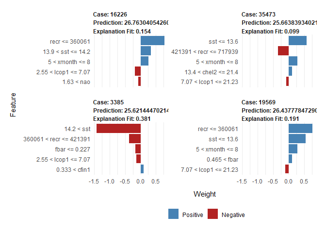<!-- -->


W przypadku większej ilości przypadków można je zwizualizować na wykresie w postaci heatmap.
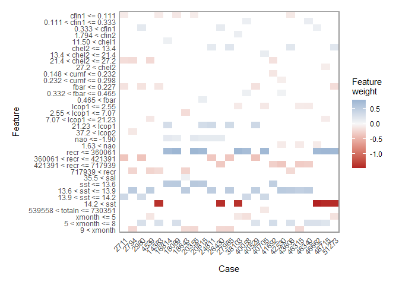<!-- -->

XGBoost oferuje wbudowane feature importance mierzone przy pomocy parametru `gain`. Pośród użytych atrybutów zdecydowanie dominuje `sst`, mając ponad połowę z całego zysku przy podejmowaniu decyzji. Następny jest atrybut `recr` mający ponaddwukrotnie większą ważność od swojego następnika. Pozostałe zmienne mają już mniejszy, ale bardziej równomierny wkład w decyzję.

```r
importanceRaw <- xgb.importance(feature_names = colnames(test_set[,-1]), model = xg, data = xgb_test_set)
xgb.plot.importance(importance_matrix = importanceRaw)
```

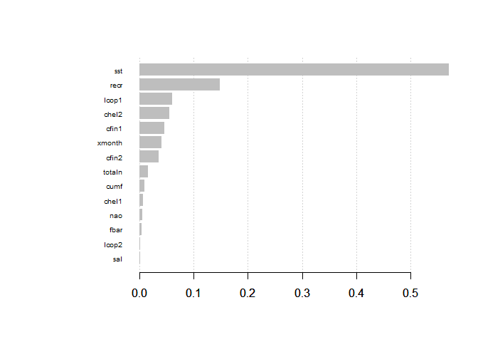<!-- -->

Z dużego wpływu temperatury przy powierzchni wody (`sst`) na podejmowaną przez model decyzję można by wnioskować, że drobny wzrost temperatury (mniej więcej od podobnego okresu, gdy długość śledzia zaczęła spadać) mógł mieć wpływ na zmniejszenie rozmiaru poławianych śledzi.
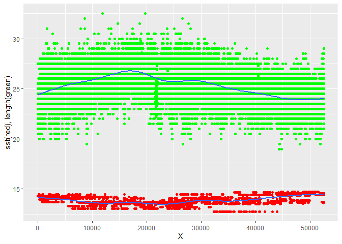<!-- -->
